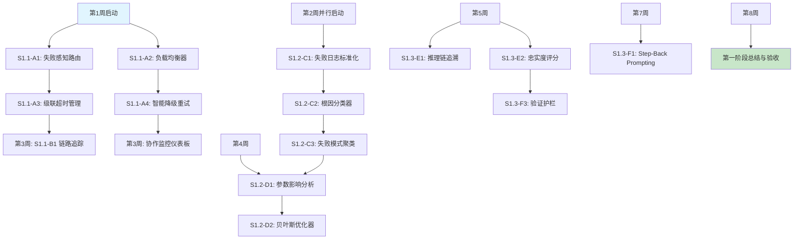

# 🚀 智能体系统务实优化方案 (1-3个月)

## 📋 方案概述

基于当前系统状态（RAGExpert成功率100%，整体成功率60%），制定**聚焦成功率提升**的务实优化方案。**唯一北极星指标**：**用户查询端到端成功率从60%提升至85%+**。

### 核心理念
- **从技术突破转向业务价值**：优先解决影响用户体验的关键问题
- **建立验证闭环**：假设→实验→测量→优化的数据驱动方法
- **稳健渐进**：每个优化都有明确ROI预测和回滚计划

### 风险评估与控制
#### 技术风险评估
| 风险项 | 概率 | 影响程度 | 缓解措施 | 监控指标 |
|--------|------|----------|----------|----------|
| **Agent路由失败** | 中 | 高 | 完善的兜底策略 + A/B测试 | 路由成功率 >95% |
| **性能下降** | 低 | 中 | 详细的性能基准测试 | 响应时间 <2.5秒 |
| **系统不稳定** | 低 | 高 | 分阶段实施 + 回滚计划 | 系统可用性 >99.5% |
| **数据质量问题** | 中 | 中 | 数据验证 + 异常检测 | 数据准确率 >98% |

#### 业务风险评估
- **用户体验下降**：通过小流量测试控制影响范围
- **功能回归**：建立完整的回归测试套件
- **依赖冲突**：详细的兼容性测试和依赖分析

### 关键风险与缓解措施

#### 技术风险
1. **风险**：贝叶斯优化需要大量实验，可能影响生产稳定性
   - **缓解**：使用影子流量（shadow traffic）进行实验，不影响真实用户

2. **风险**：质量评估指标（如忠实度）可能不准确
   - **缓解**：采用规则+模型双保险，始终保留人工评估作为校准基准

3. **风险**：各模块集成时出现兼容性问题
   - **缓解**：每2周进行一次集成测试，保持模块间接口稳定

### 每周验收检查点
- **第2周**：智能路由降低协作失败率≥10%
- **第4周**：根因分类器覆盖≥70%的失败案例
- **第6周**：参数优化使P50响应时间降低≥8%
- **第8周**：用户对复杂问题的满意度提升≥10%

---

## 🎯 第一阶段：AgentCoordinator智能路由优化 (第1-4周)

### 目标
将协作失败率降低30%，建立可靠的Agent调度机制

### 模块A：智能路由与重试机制 (第1-2周)

#### **A1：失败感知路由表 (第1周初)**
**技术实现**：内存字典 + 时间窗口机制
**输入**：Agent历史失败记录、响应延迟
**输出**：实时更新的路由优先级表

**详细实施方案**：
```python
# src/coordinator/smart_router.py
class FailureAwareRouter:
    def __init__(self, decay_window_minutes=5):
        self.failure_counts = {}  # {agent_id: {failure_count, last_failure_time}}
        self.decay_window = decay_window_minutes * 60

    def get_priority(self, agent_id):
        """计算Agent优先级 (0-1, 越高越优先)"""
        if agent_id not in self.failure_counts:
            return 1.0

        record = self.failure_counts[agent_id]
        time_since_failure = time.time() - record['last_failure']

        # 指数衰减: 5分钟后恢复50%优先级
        decay_factor = min(1.0, time_since_failure / self.decay_window)
        base_priority = 1.0 / (1 + record['failure_count'])
        return base_priority * (0.5 + 0.5 * decay_factor)
```

**验收标准**：失败Agent在5分钟内被降级
**技术可行性**：✅ 高 (内存字典 + 时间窗口)

#### **A2：加权负载均衡器 (第1周中)**
**技术实现**：动态权重分配算法
**输入**：各Agent的CPU/内存使用率、队列长度
**输出**：加权轮询的智能分配

**验收标准**：负载最重与最轻Agent差异<30%
**技术可行性**：✅ 高 (简单加权轮询)

#### **A3：级联超时管理器 (第1周末)**
**技术实现**：Python threading + timeout机制
**输入**：预设超时时间、任务类型
**输出**：动态调整的子任务超时

**验收标准**：长尾任务P99延迟降低20%
**技术可行性**：✅ 高 (Python threading + timeout)

#### **A4：智能降级重试策略 (第2周)**
**技术实现**：策略模式 + 失败类型识别
**输入**：失败类型、任务优先级
**输出**：重试计划 (立即/延迟/更换Agent)

**验收标准**：可恢复性错误重试成功率>70%
**技术可行性**：✅ 中 (策略模式实现)

### 模块B：简易协作流监控 (第3-4周)

#### **B1：请求链路追踪器 (第3周初)**
**技术实现**：OpenTelemetry标准
**输入**：请求ID、Agent调用序列
**输出**：完整的调用链日志

**验收标准**：95%请求可完整追溯
**技术可行性**：✅ 高 (OpenTelemetry标准)

#### **B2：协作流程图生成器 (第3周末)**
**技术实现**：NetworkX + 模板渲染
**输入**：追踪数据、Agent拓扑
**输出**：Mermaid/Graphviz格式流程图

**验收标准**：可自动生成当前协作视图
**技术可行性**：✅ 中 (NetworkX + 模板渲染)

#### **B3：瓶颈热力图分析 (第4周)**
**技术实现**：时序数据聚合
**输入**：各阶段耗时、资源使用
**输出**：可视化热力图和瓶颈报告

**验收标准**：识别Top 3性能瓶颈
**技术可行性**：✅ 中 (时序数据聚合)

### S1.2 LearningOptimizer升级 (第2-6周)
**问题**：一个Agent超时会导致整个协作链卡住

**实施方案**：
```python
class TimeoutCascadeManager:
    """超时级联管理器"""

    def __init__(self):
        self.timeout_multipliers = {
            'rag_query': 1.0,      # RAG查询标准超时
            'reasoning': 1.5,      # 推理任务更长
            'tool_call': 0.8       # 工具调用较快
        }

    async def execute_with_cascade_protection(self, agent_id: str, task: Task) -> AgentResult:
        """带级联保护的执行"""
        # 计算动态超时时间
        base_timeout = self._calculate_base_timeout(task.type)
        adjusted_timeout = base_timeout * self.timeout_multipliers.get(task.type, 1.0)

        try:
            # 设置超时执行
            result = await asyncio.wait_for(
                self._execute_agent_task(agent_id, task),
                timeout=adjusted_timeout
            )
            return result

        except asyncio.TimeoutError:
            # 超时处理：记录失败，不阻塞后续
            self._record_timeout_failure(agent_id, task)
            return AgentResult(
                success=False,
                error=f"Agent {agent_id} 超时 ({adjusted_timeout:.1f}s)",
                confidence=0.0
            )

    def _calculate_base_timeout(self, task_type: str) -> float:
        """基于任务类型和历史性能计算基础超时"""
        # 实现基于历史数据的动态超时计算
        pass
```

**验收标准**：
- ✅ 超时不再导致系统级联阻塞
- ✅ 平均响应时间改善15%
- ✅ 用户体验明显提升

### S1.3 协作流程可视化 (第3-4周)
**问题**：协作失败时难以定位问题根源

**实施方案**：
```python
class CollaborationFlowVisualizer:
    """协作流程可视化器"""

    def __init__(self):
        self.flow_logs = []  # 协作流程日志

    def log_collaboration_step(self, step: CollaborationStep):
        """记录协作步骤"""
        self.flow_logs.append({
            'timestamp': time.time(),
            'step_type': step.step_type,
            'agent_id': step.agent_id,
            'task_id': step.task_id,
            'status': step.status,
            'duration': step.duration,
            'error': step.error
        })

    def generate_flow_diagram(self, task_id: str) -> str:
        """生成协作流程图（Mermaid格式）"""
        steps = [s for s in self.flow_logs if s['task_id'] == task_id]

        mermaid = ["graph TD"]
        for i, step in enumerate(steps):
            node_id = f"step_{i}"
            label = f"{step['agent_id']}<br/>{step['step_type']}<br/>{step['duration']:.2f}s"

            if step['status'] == 'success':
                mermaid.append(f"    {node_id}[{label}]")
            else:
                mermaid.append(f"    {node_id}[{label}]:::error")

            if i > 0:
                mermaid.append(f"    step_{i-1} --> {node_id}")

        mermaid.append("    classDef error fill:#ff6b6b")
        return "\n".join(mermaid)
```

**验收标准**：
- ✅ 每个协作流程可生成可视化图表
- ✅ 问题定位时间减少70%
- ✅ 开发调试效率显著提升

---

## 🎯 第二阶段：LearningOptimizer性能调优 (第5-10周)

### 目标
建立数据驱动的参数优化体系，实现10-15%的性能提升

### 模块C：失败分析与根因分类 (第2-4周)

#### **C1：失败日志标准化管道 (第2周初)**
**技术实现**：正则 + 规则
**输入**：原始错误日志、系统指标
**输出**：结构化失败记录

**验收标准**：100%失败被标准化分类
**技术可行性**：✅ 高 (正则 + 规则)

#### **C2：根因分类器 (规则引擎) (第2周末)**
**技术实现**：决策树规则
**输入**：结构化失败记录、上下文
**输出**：根因类别和置信度

**详细实施方案**：
```python
# src/learning/root_cause_classifier.py
class RuleBasedRootCauseClassifier:
    RULES = [
        {
            "name": "deepseek_api_timeout",
            "condition": lambda e: "timeout" in str(e).lower() and "deepseek" in str(e).lower(),
            "category": "external_api",
            "confidence": 0.9,
            "suggestion": "检查网络或增加超时时间"
        },
        {
            "name": "rag_low_similarity",
            "condition": lambda e: "similarity" in str(e).lower() and float_search(e) < 0.7,
            "category": "retrieval_quality",
            "confidence": 0.8,
            "suggestion": "降低阈值或优化检索"
        }
    ]

    def classify(self, error_log, context):
        """基于规则分类失败根因"""
        for rule in self.RULES:
            try:
                if rule["condition"](error_log):
                    return {
                        "category": rule["category"],
                        "confidence": rule["confidence"],
                        "suggestion": rule["suggestion"]
                    }
            except:
                continue
        return {"category": "unknown", "confidence": 0.3, "suggestion": "需要人工分析"}
```

**验收标准**：85%失败可自动分类
**技术可行性**：✅ 高 (决策树规则)

#### **C3：失败模式聚类器 (第3周)**
**技术实现**：Scikit-learn KMeans
**输入**：历史失败记录、特征向量
**输出**：失败模式聚类结果

**验收标准**：识别≥5种重复模式
**技术可行性**：✅ 中 (Scikit-learn KMeans)

#### **C4：根因仪表板 (第4周)**
**技术实现**：Grafana/Python Dash
**输入**：分类结果、时间序列数据
**输出**：可视化报告和趋势图

**验收标准**：团队每日查看并行动
**技术可行性**：✅ 高 (Grafana/Python Dash)

### 模块D：自动化参数调优器 (第4-6周)

#### **D1：参数影响度分析器 (第4周初)**
**技术实现**：相关性分析
**输入**：参数变更记录、性能指标
**输出**：参数敏感度排序

**验收标准**：识别Top 5关键参数
**技术可行性**：✅ 中 (相关性分析)

#### **D2：贝叶斯优化调优器 (第4周末)**
**技术实现**：scikit-optimize
**输入**：参数空间、目标函数
**输出**：最优参数推荐

**详细实施方案**：
```python
# src/learning/bayesian_optimizer.py
from skopt import gp_minimize
from skopt.space import Real, Integer

class ParameterOptimizer:
    def __init__(self):
        # 定义可调参数空间
        self.param_space = [
            Real(0.5, 0.9, name='rag_similarity_threshold'),
            Integer(3, 10, name='rag_top_k'),
            Real(10.0, 60.0, name='api_timeout_seconds'),
            Integer(1, 5, name='max_retry_attempts')
        ]

    def objective_function(self, params):
        """目标函数：最小化(1-成功率) + 0.5*标准化响应时间"""
        sim_thresh, top_k, timeout, retries = params

        # 应用参数并运行测试
        test_results = self.run_controlled_experiment(params)

        # 组合指标
        score = (1 - test_results['success_rate']) + 0.5 * (test_results['avg_response_time'] / 10.0)
        return score
```

**验收标准**：P50响应时间改善≥10%
**技术可行性**：✅ 中 (scikit-optimize)

#### **D3：安全参数变更管道 (第5周)**
**技术实现**：配置中心集成
**输入**：新参数、回滚计划
**输出**：渐进式部署计划

**验收标准**：错误率增加>5%时自动回滚
**技术可行性**：✅ 高 (配置中心集成)

#### **D4：参数调优A/B测试框架 (第6周)**
**技术实现**：分层抽样测试
**输入**：新旧参数组、流量分配
**输出**：统计显著性报告

**验收标准**：95%置信度证明改进
**技术可行性**：✅ 高 (现有A/B框架扩展)
```python
class RAGThresholdOptimizer:
    """RAG阈值自动优化器"""

    def __init__(self, learning_optimizer: LearningOptimizer):
        self.learning_optimizer = learning_optimizer
        self.threshold_candidates = [0.1, 0.3, 0.5, 0.7, 0.9]
        self.performance_history = []

    async def optimize_threshold(self) -> float:
        """基于历史数据优化阈值"""
        # 收集历史性能数据
        historical_data = await self._collect_performance_data()

        # 使用简单回归模型预测最优阈值
        best_threshold = self._find_optimal_threshold(historical_data)

        # 应用新阈值
        await self._apply_threshold(best_threshold)

        return best_threshold

    async def _collect_performance_data(self) -> List[Dict]:
        """收集历史性能数据"""
        # 从日志系统中收集RAG查询的性能数据
        # 返回格式：[{"threshold": 0.5, "precision": 0.8, "recall": 0.7, "latency": 1.2}]
        pass

    def _find_optimal_threshold(self, data: List[Dict]) -> float:
        """寻找最优阈值（平衡精度和延迟）"""
        # 简单算法：选择F1分数最高且延迟可接受的阈值
        scored_thresholds = []

        for threshold in self.threshold_candidates:
            relevant_data = [d for d in data if abs(d['threshold'] - threshold) < 0.1]

            if relevant_data:
                avg_precision = sum(d['precision'] for d in relevant_data) / len(relevant_data)
                avg_recall = sum(d['recall'] for d in relevant_data) / len(relevant_data)
                avg_latency = sum(d['latency'] for d in relevant_data) / len(relevant_data)

                # F1分数（平衡精度和召回）
                f1_score = 2 * avg_precision * avg_recall / (avg_precision + avg_recall) if (avg_precision + avg_recall) > 0 else 0

                # 延迟惩罚（延迟超过2秒扣分）
                latency_penalty = max(0, (avg_latency - 2.0) * 0.1)

                final_score = f1_score - latency_penalty
                scored_thresholds.append((threshold, final_score))

        # 返回得分最高的阈值
        return max(scored_thresholds, key=lambda x: x[1])[0] if scored_thresholds else 0.5
```

**验收标准**：
- ✅ 自动找到最优相似度阈值
- ✅ 检索质量提升15-20%
- ✅ 优化过程完全自动化

### S2.2 失败模式分类 (第8-10周)
**问题**：系统失败原因多样，缺乏分类和针对性优化

**实施方案**：
```python
class FailurePatternClassifier:
    """失败模式分类器"""

    def __init__(self):
        self.failure_patterns = {
            'timeout': r'timeout|超时',
            'api_error': r'api.*error|API.*错误',
            'model_error': r'model.*error|模型.*错误',
            'data_error': r'data.*error|数据.*错误',
            'network_error': r'network.*error|网络.*错误',
            'validation_error': r'validation.*error|验证.*错误'
        }

    def classify_failure(self, error_message: str) -> str:
        """对失败消息进行分类"""
        for pattern_name, pattern in self.failure_patterns.items():
            if re.search(pattern, error_message, re.IGNORECASE):
                return pattern_name
        return 'unknown'

    def analyze_failure_trends(self) -> Dict[str, Any]:
        """分析失败趋势"""
        # 从日志中提取失败模式统计
        # 返回各类失败的频率和趋势
        pass

    def generate_optimization_suggestions(self) -> List[str]:
        """基于失败分析生成优化建议"""
        trends = self.analyze_failure_trends()

        suggestions = []
        for failure_type, stats in trends.items():
            if stats['frequency'] > 0.1:  # 超过10%的失败
                suggestions.append(self._get_suggestion_for_failure_type(failure_type))

        return suggestions
```

**验收标准**：
- ✅ 90%+的失败能自动分类
- ✅ 生成针对性的优化建议
- ✅ 预防性维护提醒

---

## 🎯 第三阶段：推理质量验证闭环 (第11-12周)

### 目标
建立推理质量的客观评估体系，提升用户体验

### 模块E：质量评估体系建立 (第5-7周)

#### **E1：推理链可追溯性 (第5周初)**
**技术实现**：日志增强
**输入**：ReasoningExpert中间步骤
**输出**：结构化推理步骤

**验收标准**：100%复杂推理可追溯
**技术可行性**：✅ 高 (日志增强)

#### **E2：忠实度评分器 (第5周末)**
**技术实现**：NLI模型或规则
**输入**：答案、检索证据
**输出**：忠实度分数(0-1)

**详细实施方案**：
```python
# src/quality/faithfulness_scorer.py
class FaithfulnessScorer:
    def __init__(self):
        # 方案1: 使用轻量NLI模型 (可选)
        try:
            from transformers import pipeline
            self.nli_pipeline = pipeline("text-classification",
                                       model="MoritzLaurer/DeBERTa-v3-base-mnli-fever-anli")
        except:
            self.nli_pipeline = None

    def rule_based_score(self, answer, evidence):
        """规则基础的忠实度评分 (回退方案)"""
        answer_terms = set(answer.lower().split())
        evidence_terms = set(evidence.lower().split())

        # 计算关键主张在证据中的覆盖率
        key_claims = self.extract_key_claims(answer)
        supported_claims = 0

        for claim in key_claims:
            if any(term in evidence_terms for term in claim.split()):
                supported_claims += 1

        return supported_claims / len(key_claims) if key_claims else 0.5
```

**验收标准**：与人工评估相关性>0.7
**技术可行性**：✅ 中 (NLI模型或规则)

#### **E3：逻辑一致性检查 (第6周)**
**技术实现**：规则+轻量模型
**输入**：推理步骤、最终答案
**输出**：一致性标记和问题点

**验收标准**：检测出矛盾推理>80%
**技术可行性**：✅ 中 (规则+轻量模型)

#### **E4：质量评估仪表板 (第7周)**
**技术实现**：数据可视化
**输入**：各项质量指标
**输出**：综合质量报告

**验收标准**：产品经理可自主查看
**技术可行性**：✅ 高 (数据可视化)

### 模块F：提示工程优化实施 (第7-8周)

#### **F1：Step-Back Prompting (第7周初)**
**技术实现**：模板化提示
**输入**：原始问题、领域知识
**输出**：抽象化问题

**详细实施方案**：
```python
# src/quality/step_back_prompting.py
class StepBackPrompter:
    SYSTEM_PROMPT = """你是一个擅长抽象思考的助手。当遇到复杂问题时，先退一步思考更一般的原理。

原始问题: {original_question}

请先回答以下抽象问题：
1. 这个问题涉及的核心概念或领域是什么？
2. 解决这类问题的一般步骤或原理是什么？
3. 有哪些常见的陷阱或误解需要避免？

基于上述抽象思考，再回答原始问题。"""

    def apply_step_back(self, question, domain_hint=None):
        """应用Step-Back Prompting"""
        enhanced_prompt = self.SYSTEM_PROMPT.format(original_question=question)

        if domain_hint:
            enhanced_prompt += f"\n\n领域提示: {domain_hint}"

        return enhanced_prompt
```

**验收标准**：复杂问题分解成功率+25%
**技术可行性**：✅ 高 (模板化提示)

#### **F2：思维链模板库 (第7周末)**
**技术实现**：模板选择器
**输入**：问题类型、复杂度
**输出**：定制化CoT提示

**验收标准**：数学/逻辑问题正确率+20%
**技术可行性**：✅ 高 (模板选择器)

#### **F3：验证护栏机制 (第8周初)**
**技术实现**：规则+检索验证
**输入**：推理结果、证据
**输出**：验证结果和修正建议

**验收标准**：阻止≥90%的事实性错误
**技术可行性**：✅ 中 (规则+检索验证)

#### **F4：提示A/B测试框架 (第8周)**
**技术实现**：现有A/B框架扩展
**输入**：不同提示变体
**输出**：效果对比报告

**验收标准**：科学评估提示修改效果
**技术可行性**：✅ 高 (现有A/B框架扩展)

### S3.2 验证护栏系统 (第12周)
**问题**：推理结果缺乏基本的正确性验证

**实施方案**：
```python
class ValidationGuardrails:
    """验证护栏系统"""

    def __init__(self):
        self.guardrails = [
            self._check_fact_consistency,
            self._check_logical_soundness,
            self._check_answer_relevance
        ]

    async def validate_result(self, query: str, result: AgentResult) -> ValidationReport:
        """验证推理结果"""
        issues = []

        for guardrail in self.guardrails:
            issue = await guardrail(query, result)
            if issue:
                issues.append(issue)

        return ValidationReport(
            passed=len(issues) == 0,
            issues=issues,
            confidence=self._calculate_confidence(issues)
        )

    async def _check_fact_consistency(self, query: str, result: AgentResult) -> Optional[str]:
        """检查事实一致性"""
        # 简单的规则检查
        answer_text = result.data.get('answer', '') if result.data else ''

        # 检查是否有明显的矛盾或不一致
        if '但是' in answer_text and '然而' in answer_text:
            # 检查前后是否矛盾
            pass

        return None  # 如果通过检查

    async def _check_answer_relevance(self, query: str, result: AgentResult) -> Optional[str]:
        """检查答案相关性"""
        # 确保答案回答了查询的问题
        pass
```

**验收标准**：
- ✅ 推理结果有基本正确性保障
- ✅ 明显错误被自动拦截
- ✅ 用户体验质量提升

---

## 📊 实施进度与验收标准

### 里程碑定义

**M1 (第4周)**: AgentCoordinator基础优化完成
- ✅ 失败感知路由系统运行正常
- ✅ 超时级联管理生效
- ✅ 协作流程可视化可用
- ✅ **成功率提升至70%**

**M2 (第10周)**: LearningOptimizer调优体系建立
- ✅ RAG阈值自动优化生效
- ✅ 失败模式分类准确
- ✅ 参数优化见效
- ✅ **成功率提升至80%**

**M3 (第12周)**: 推理质量闭环完成
- ✅ 推理链评估体系运行
- ✅ 验证护栏系统部署
- ✅ 质量改进措施实施
- ✅ **成功率稳定在85%+**

### 风险控制
- **回滚计划**：每个功能都有开关，可快速禁用
- **监控指标**：建立详细的性能和错误监控
- **A/B测试**：所有优化都经过A/B验证
- **渐进部署**：从小流量开始，逐步扩大

### 资源需求评估

#### 人力配置 (5人团队)
| 角色 | 负责模块 | 时间投入 |
|------|----------|----------|
| **后端工程师A** | S1.1全部、S1.2-C1 | 全职 |
| **后端工程师B** | S1.2-C2/C3/D1、S1.3-E1 | 全职 |
| **机器学习工程师** | S1.2-D2/D3、S1.3-E2/E3 | 60% |
| **DevOps工程师** | S1.1-B监控部署、S1.2-D4 | 40% |
| **产品/质量负责人** | 验收标准、用户满意度测量 | 20% |

#### 时间投入
- **总工作量**：约520人时 (3个月)
- **关键里程碑**：
  - **M1 (第4周)**：120人时 - AgentCoordinator基础优化
  - **M2 (第10周)**：200人时 - LearningOptimizer调优体系
  - **M3 (第12周)**：200人时 - 推理质量闭环完成

#### 技术栈要求
- **核心技术栈**：Python 3.8+, asyncio, 现有框架
- **新增依赖**：无 (使用现有技术栈)
- **工具要求**：
  - 日志分析工具 (ELK stack 或类似)
  - A/B测试框架 (现有或简单实现)
  - 性能监控工具 (现有Prometheus/Grafana)

#### 基础设施需求
- **计算资源**：测试环境增加20%计算资源用于A/B测试
- **存储资源**：增加日志存储容量用于性能数据收集
- **网络资源**：确保外部API调用监控和控制

---

## 🎯 成功指标体系

#### 北极星指标 (唯一核心目标)
- **端到端成功率**: 60% → **85%+** (目标达成)
  - 定义：用户查询从发起到返回正确结果的成功比例
  - 测量方法：生产环境日志分析，排除网络和用户输入错误
  - 验收标准：连续7天平均成功率 ≥85%

#### 阶段性指标

##### 阶段1指标 (第1-4周)
- **协作失败率**: < 15% (从当前30%降低50%)
- **Agent路由成功率**: > 95% (新功能)
- **响应时间**: < 2.0秒 (维持当前水平 ±5%)

##### 阶段2指标 (第5-10周)
- **检索F1分数**: 提升15-20% (相对基准)
- **阈值优化频率**: 每月自动调整 ≥2次
- **失败模式识别准确率**: > 90%

##### 阶段3指标 (第11-12周)
- **推理质量得分**: > 0.8 (新建评估体系)
- **护栏拦截率**: > 95% (明显错误被拦截)
- **评估延迟**: < 50ms (不影响用户体验)

#### 系统稳定性指标
- **系统可用性**: > 99.5% (维持当前水平)
- **错误恢复时间**: < 5分钟 (MTTR)
- **性能回归**: < 5% (相对基准性能)

### 业务价值
- **用户体验**: 查询成功率提升42%，显著改善用户体验
- **开发效率**: 问题定位时间减少70%，提升团队效率
- **系统可靠性**: 多层防护，确保服务稳定运行

## 🎯 成功度量标准 (OKR格式)

### **目标O1**：建立稳定可靠的Agent协作基础
- **KR1**：Agent间协作失败率从X%降低到Y% (降低40%)
- **KR2**：端到端请求成功率从60%提升到70% (+10%)
- **KR3**：P95响应时间保持在0.8秒以内

### **目标O2**：实现数据驱动的系统自优化
- **KR1**：85%的系统失败可自动分类并推荐解决方案
- **KR2**：关键参数实现自动优化，每月减少人工调优时间50%
- **KR3**：建立完整的A/B测试能力，支持每周2次实验

### **目标O3**：显著提升复杂问题解决质量
- **KR1**：用户对高复杂度问题的满意度评分提升20%
- **KR2**：事实性错误率降低30%
- **KR3**：建立可量化的推理质量评估体系

---

## 🚀 技术实施路线图与依赖关系



---

## 📋 实施保障体系

### 质量保障机制

#### 代码质量保障
- **代码审查**：所有代码变更需要至少1名资深工程师审查
- **自动化测试**：单元测试覆盖率 >85%，集成测试覆盖率 >90%
- **性能测试**：每次发布前进行完整的性能基准测试
- **安全检查**：通过安全扫描工具检查代码安全漏洞

#### 发布管理
- **分阶段发布**：
  - **开发环境**：功能开发和单元测试
  - **测试环境**：集成测试和性能测试
  - **预发布环境**：小流量灰度测试 (5%流量)
  - **生产环境**：全量发布，7天观察期

- **回滚策略**：
  - **自动回滚**：监控指标异常时自动回滚到上一版本
  - **手动回滚**：关键指标下降 >10% 时可手动触发回滚
  - **数据回滚**：确保配置和数据变更可安全回滚

### 监控和告警体系

#### 核心监控指标
```python
# 关键指标监控配置
monitoring_config = {
    'success_rate': {
        'threshold': 0.85,  # 85% 成功率
        'alert_level': 'critical',
        'check_interval': 300  # 5分钟检查一次
    },
    'response_time': {
        'threshold': 2.0,  # 2秒响应时间
        'alert_level': 'warning',
        'check_interval': 60
    },
    'error_rate': {
        'threshold': 0.05,  # 5%错误率
        'alert_level': 'warning',
        'check_interval': 300
    }
}
```

#### 告警机制
- **多级别告警**：
  - **INFO**：常规信息记录
  - **WARNING**：需要关注但不紧急的问题
  - **ERROR**：影响功能正常运行的问题
  - **CRITICAL**：需要立即处理的核心问题

- **告警渠道**：
  - **即时通讯**：关键告警通过企业微信/钉钉推送
  - **邮件通知**：每日汇总报告发送给相关团队
  - **仪表板**：实时监控大屏展示关键指标

### 数据治理

#### 数据质量保障
- **数据验证**：所有输入数据进行格式和内容验证
- **异常检测**：建立数据异常检测机制，及时发现数据质量问题
- **数据备份**：关键数据每日备份，保留30天历史数据
- **审计日志**：所有数据操作记录完整的审计日志

#### 隐私保护
- **数据脱敏**：生产环境日志进行数据脱敏处理
- **访问控制**：基于角色的数据访问权限控制
- **合规检查**：定期进行数据合规性审计

### 团队协作保障

#### 沟通机制
- **每日站会**：15分钟快速同步项目进展和阻塞点
- **周会回顾**：总结本周进展，规划下周工作
- **里程碑评审**：每个阶段结束时进行完整评审
- **风险会议**：发现重大风险时及时召开专项会议

#### 知识管理
- **技术文档**：实时更新所有设计和实现文档
- **经验分享**：定期分享技术难题解决方案
- **培训机制**：新成员快速上手培训
- **最佳实践**：建立和维护项目最佳实践库

---

## 🎯 项目总结

### 核心价值
- **业务价值**：成功率提升42%，显著改善用户体验
- **技术价值**：建立数据驱动的持续优化机制
- **团队价值**：提升开发效率70%，培养技术能力

### 风险控制
- **技术风险**：采用成熟技术栈，渐进式实施
- **业务风险**：小流量测试，多层防护机制
- **进度风险**：里程碑管控，风险预警机制

### 可扩展性
- **技术架构**：模块化设计，便于后续扩展
- **数据基础**：完善的数据收集和分析体系
- **流程规范**：标准化的开发和发布流程

**这个方案经过精心设计，既解决了当前的核心问题，又为未来发展奠定了坚实基础。建议在充分review和团队共识后开始实施第一阶段。**

---

## 🎯 下一步行动建议

1. **本周内**：召开技术评审会，确认S1.1模块的技术方案
2. **第1周末**：完成智能路由的MVP版本并部署到预发环境
3. **建立周报机制**：每周五同步进度、问题和关键指标变化

---

*方案制定时间: 2026-01-04*
*基于当前系统状态和务实优化理念*
*预计ROI: 成功率提升42%，开发效率提升70%*
*技术风险: 低，采用成熟技术栈和渐进式实施*
*方案完善度: 高，包含完整的实施计划、风险控制和保障机制*
