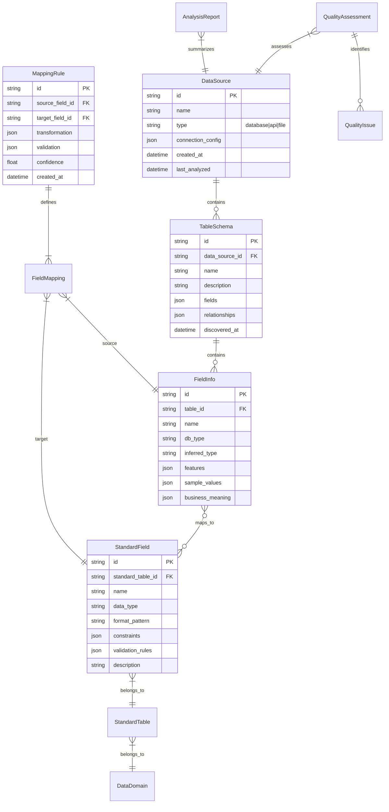

# 异构系统数据自动发现与标准化详细设计方案

## 项目概述

### 问题背景
企业面临十几套不同时期、不同厂商开发的异构系统，数据混乱无统一标准，数据中台实施困难。需要自动化的数据发现、分析和标准化能力，以加速数据中台实施。

### 解决方案目标
扩展RANGEN系统，增加**智能数据发现与标准化引擎**，实现以下能力：
1. **自动Schema发现**：从异构系统（数据库、API、文件）自动提取数据结构和元数据
2. **智能标准建议**：基于行业最佳实践和现有模式推荐数据标准
3. **自动化映射生成**：生成源系统到标准目标的转换规则和代码
4. **数据质量评估**：评估现有数据质量，识别问题和改进点

### 设计原则
1. **渐进式扩展**：基于RANGEN现有架构扩展，最小化核心系统改动
2. **模块化设计**：各功能模块独立，可按需部署和扩展
3. **AI驱动**：充分利用RANGEN的AI能力进行智能分析和建议
4. **业务友好**：输出业务可理解的标准文档和实施路线图
5. **安全合规**：遵循RANGEN四级数据分类和安全框架

---

## 一、总体架构设计

### 1.1 在RANGEN架构中的定位

```
RANGEN扩展架构 - 智能数据发现与标准化引擎
├── 用户层 (User Layer)
│   └── 新增: 数据治理控制台 (Data Governance Console)
├── 接入层 (Access Layer)
│   └── 新增: 数据连接网关 (Data Connection Gateway)
├── 智能体层 (Agent Layer)
│   └── 新增: 
│       ├── 数据发现智能体 (Data Discovery Agent)
│       ├── 标准建议智能体 (Standard Recommendation Agent)
│       └── 映射生成智能体 (Mapping Generation Agent)
├── 服务层 (Service Layer) ★ 主要扩展层
│   └── 新增:
│       ├── 数据发现服务 (Data Discovery Service)
│       ├── 标准管理服务 (Standard Management Service)
│       ├── 映射规则服务 (Mapping Rule Service)
│       ├── 数据质量服务 (Data Quality Service)
│       └── 报告生成服务 (Report Generation Service)
├── 数据层 (Data Layer)
│   └── 新增:
│       ├── 元数据存储 (Metadata Storage)
│       ├── 标准定义存储 (Standard Definition Storage)
│       ├── 映射规则存储 (Mapping Rule Storage)
│       └── 分析结果存储 (Analysis Result Storage)
└── 基础设施层 (Infrastructure Layer)
    └── 新增: 数据连接器运行时 (Connector Runtime)
```

### 1.2 核心数据流

```
数据发现流程:
1. 用户配置数据源连接信息
2. 数据连接网关建立安全连接
3. 数据发现服务调用相应连接器
4. 提取元数据和数据样本
5. 数据质量服务评估数据质量
6. 标准管理服务推荐数据标准
7. 映射规则服务生成转换规则
8. 报告生成服务创建分析报告
9. 结果存储到相应数据存储

标准应用流程:
1. 用户确认推荐的数据标准
2. 映射规则服务生成完整映射
3. 代码生成服务创建转换代码
4. 部署到数据中台ETL流程
5. 数据质量服务监控执行结果
6. 反馈循环优化标准建议
```

### 1.3 技术架构栈

| 层级 | 技术组件 | 说明 |
|------|----------|------|
| **用户界面** | Vue.js + Element UI | 数据治理控制台 |
| **API网关** | FastAPI + OpenAPI | RESTful API接口 |
| **核心服务** | Python 3.9+ | 基于RANGEN现有服务框架 |
| **数据处理** | Pandas, Polars, DuckDB | 数据采样和分析 |
| **AI/ML** | RANGEN AI引擎 | 智能分析和建议 |
| **数据存储** | PostgreSQL, Redis | 主存储和缓存 |
| **消息队列** | Redis Streams/Celery | 异步任务处理 |
| **容器化** | Docker, Kubernetes | 部署和编排 |

---

## 二、核心模块详细设计

### 2.1 数据发现服务 (Data Discovery Service)

#### 2.1.1 连接器管理器 (Connector Manager)

```python
class DataConnectorManager:
    """数据连接器管理器 - 统一管理所有数据源连接"""
    
    def __init__(self):
        self.connectors = {
            'jdbc': JDBCConnector(),
            'api': APIConnector(), 
            'file': FileConnector(),
            'cdc': CDCConnector(),
            'cloud': CloudConnector()
        }
        self.connection_pool = ConnectionPool()
        self.security_context = SecurityContext()
    
    async def connect(self, config: ConnectionConfig) -> ConnectionResult:
        """建立数据源连接"""
        # 1. 验证配置合法性
        # 2. 安全检查（数据分类、访问权限）
        # 3. 选择合适连接器
        # 4. 建立连接并测试
        # 5. 记录连接审计日志
    
    async def discover_schema(self, connection_id: str) -> SchemaDiscoveryResult:
        """发现数据源Schema"""
        # 1. 获取表/对象列表
        # 2. 提取字段元数据
        # 3. 分析数据类型和约束
        # 4. 采样分析数据内容
        # 5. 推断业务含义
    
    async def sample_data(self, connection_id: str, table_name: str, 
                         sample_size: int = 1000) -> DataSample:
        """采样数据进行分析"""
        # 智能采样策略：分层采样、随机采样、全覆盖采样
```

#### 2.1.2 Schema发现器 (Schema Discoverer)

```python
class IntelligentSchemaDiscoverer:
    """智能Schema发现器 - 基于RANGEN AI能力扩展"""
    
    def __init__(self, ai_engine: AIEngine):
        self.ai_engine = ai_engine
        self.pattern_library = PatternLibrary()
        self.inference_rules = InferenceRules()
    
    async def discover_from_database(self, db_metadata: DatabaseMetadata) -> SchemaResult:
        """从数据库发现Schema"""
        result = SchemaResult()
        
        # 1. 表结构分析
        for table in db_metadata.tables:
            table_schema = await self._analyze_table_structure(table)
            result.add_table(table_schema)
        
        # 2. 关系发现
        relationships = await self._discover_relationships(db_metadata)
        result.add_relationships(relationships)
        
        # 3. 业务含义推断
        business_context = await self._infer_business_context(result)
        result.add_business_context(business_context)
        
        return result
    
    async def _analyze_table_structure(self, table: TableMetadata) -> TableSchema:
        """分析表结构"""
        schema = TableSchema(name=table.name)
        
        for column in table.columns:
            # 智能推断字段类型和属性
            field_info = await self._analyze_column(column, table.sample_data)
            schema.add_field(field_info)
        
        # 推断主键、外键、索引
        schema.primary_key = await self._infer_primary_key(table)
        schema.foreign_keys = await self._infer_foreign_keys(table, context)
        
        return schema
    
    async def _analyze_column(self, column: ColumnMetadata, sample_data: List) -> FieldInfo:
        """分析列信息"""
        field_info = FieldInfo(
            name=column.name,
            db_type=column.data_type,
            nullable=column.is_nullable
        )
        
        # 基于样本数据推断
        if sample_data:
            # 推断实际数据类型
            inferred_type = self._infer_data_type_from_samples(
                [row[column.name] for row in sample_data]
            )
            field_info.inferred_type = inferred_type
            
            # 分析数据特征
            features = self._analyze_data_features(sample_data, column.name)
            field_info.features = features
            
            # AI推断业务含义
            if self.ai_engine:
                business_meaning = await self.ai_engine.infer_field_meaning(
                    column.name, features, context
                )
                field_info.business_meaning = business_meaning
        
        return field_info
```

#### 2.1.3 数据采样分析器 (Data Sampler Analyzer)

```python
class DataSamplerAnalyzer:
    """数据采样分析器 - 智能数据特征分析"""
    
    def analyze_data_features(self, samples: List[Dict], field_name: str) -> DataFeatures:
        """分析数据特征"""
        features = DataFeatures(field_name=field_name)
        values = [sample[field_name] for sample in samples if field_name in sample]
        
        # 基础统计特征
        features.null_count = sum(1 for v in values if v is None)
        features.unique_count = len(set(values))
        features.value_distribution = self._calculate_value_distribution(values)
        
        # 数据类型推断
        features.inferred_data_type = self._infer_data_type(values)
        
        # 模式识别
        if features.inferred_data_type == DataType.STRING:
            features.patterns = self._detect_string_patterns(values)
        elif features.inferred_data_type == DataType.NUMERIC:
            features.statistics = self._calculate_numeric_statistics(values)
        elif features.inferred_data_type == DataType.DATETIME:
            features.temporal_patterns = self._analyze_temporal_patterns(values)
        
        # 质量指标
        features.quality_metrics = self._calculate_quality_metrics(values)
        
        return features
    
    def _infer_data_type(self, values: List) -> DataType:
        """推断数据类型"""
        # 多级推断策略
        type_scores = {
            DataType.INTEGER: 0,
            DataType.DECIMAL: 0,
            DataType.STRING: 0,
            DataType.DATETIME: 0,
            DataType.BOOLEAN: 0,
            DataType.JSON: 0
        }
        
        for value in values:
            if value is None:
                continue
                
            # 规则匹配
            if self._looks_like_integer(value):
                type_scores[DataType.INTEGER] += 1
            elif self._looks_like_decimal(value):
                type_scores[DataType.DECIMAL] += 1
            elif self._looks_like_datetime(value):
                type_scores[DataType.DATETIME] += 1
            elif self._looks_like_boolean(value):
                type_scores[DataType.BOOLEAN] += 1
            elif self._looks_like_json(value):
                type_scores[DataType.JSON] += 1
            else:
                type_scores[DataType.STRING] += 1
        
        # AI辅助推断
        if self.ai_engine:
            ai_type = await self.ai_engine.infer_data_type(values)
            type_scores[ai_type] += len(values) * 0.5  # AI结果加权
        
        return max(type_scores.items(), key=lambda x: x[1])[0]
```

### 2.2 标准管理服务 (Standard Management Service)

#### 2.2.1 标准库管理器 (Standard Library Manager)

```python
class StandardLibraryManager:
    """标准库管理器 - 管理企业数据标准"""
    
    def __init__(self):
        self.industry_standards = self._load_industry_standards()
        self.company_standards = self._load_company_standards()
        self.reference_patterns = self._load_reference_patterns()
    
    async def recommend_standards(self, discovered_schema: SchemaResult) -> StandardRecommendation:
        """推荐数据标准"""
        recommendation = StandardRecommendation()
        
        # 1. 字段命名规范推荐
        naming_recommendations = await self._recommend_naming_conventions(
            discovered_schema
        )
        recommendation.naming_conventions = naming_recommendations
        
        # 2. 数据类型标准推荐
        type_recommendations = await self._recommend_data_types(
            discovered_schema
        )
        recommendation.data_types = type_recommendations
        
        # 3. 质量规则推荐
        quality_rules = await self._recommend_quality_rules(
            discovered_schema
        )
        recommendation.quality_rules = quality_rules
        
        # 4. 参考数据推荐
        reference_data = await self._recommend_reference_data(
            discovered_schema
        )
        recommendation.reference_data = reference_data
        
        return recommendation
    
    async def _recommend_naming_conventions(self, schema: SchemaResult) -> List[NamingRule]:
        """推荐命名规范"""
        rules = []
        
        for table in schema.tables:
            # 推断业务实体类型
            entity_type = await self._infer_entity_type(table)
            
            # 基于实体类型推荐命名规则
            rule = NamingRule(
                entity_type=entity_type,
                pattern=self._get_naming_pattern(entity_type),
                examples=self._generate_examples(entity_type, table.fields),
                rationale=self._get_rationale(entity_type)
            )
            rules.append(rule)
        
        return rules
    
    def _get_naming_pattern(self, entity_type: EntityType) -> str:
        """获取命名模式"""
        patterns = {
            EntityType.CUSTOMER: "{business_domain}_{entity}_{granularity}",
            EntityType.PRODUCT: "{business_domain}_{entity}_{category}_{id}",
            EntityType.ORDER: "{business_domain}_{entity}_{timestamp}_{sequence}",
            EntityType.EMPLOYEE: "{business_domain}_{entity}_{department}_{id}",
            EntityType.SUPPLIER: "{business_domain}_{entity}_{region}_{id}"
        }
        return patterns.get(entity_type, "{business_domain}_{entity}")
```

#### 2.2.2 智能匹配引擎 (Intelligent Matching Engine)

```python
class IntelligentMatchingEngine:
    """智能匹配引擎 - 匹配源字段到标准字段"""
    
    def __init__(self, embedding_model, similarity_threshold=0.7):
        self.embedding_model = embedding_model
        self.similarity_threshold = similarity_threshold
        self.matching_strategies = [
            ExactNameMatch(),
            SynonymMatch(),
            SemanticMatch(embedding_model),
            PatternMatch(),
            ContextMatch()
        ]
    
    async def match_fields(self, source_field: FieldInfo, 
                          target_standards: List[StandardField]) -> List[MatchResult]:
        """匹配源字段到标准字段"""
        matches = []
        
        for strategy in self.matching_strategies:
            strategy_matches = await strategy.match(source_field, target_standards)
            matches.extend(strategy_matches)
        
        # 去重和排序
        unique_matches = self._deduplicate_matches(matches)
        sorted_matches = self._rank_matches(unique_matches)
        
        return sorted_matches[:5]  # 返回前5个最佳匹配
    
    async def resolve_conflicts(self, matches: List[MatchResult]) -> ConflictResolution:
        """解决匹配冲突"""
        resolution = ConflictResolution()
        
        if len(matches) == 0:
            resolution.action = ResolutionAction.CREATE_NEW
            resolution.reason = "无匹配字段，建议创建新标准字段"
        
        elif len(matches) == 1:
            resolution.action = ResolutionAction.USE_EXISTING
            resolution.selected_match = matches[0]
            resolution.confidence = matches[0].confidence
        
        else:
            # 多个匹配，需要智能选择
            best_match = self._select_best_match(matches)
            
            if best_match.confidence >= self.similarity_threshold:
                resolution.action = ResolutionAction.USE_EXISTING
                resolution.selected_match = best_match
                resolution.alternatives = [m for m in matches if m != best_match]
            else:
                resolution.action = ResolutionAction.CREATE_VARIANT
                resolution.base_match = best_match
                resolution.variant_rules = self._generate_variant_rules(best_match, source_field)
        
        return resolution
```

### 2.3 映射规则服务 (Mapping Rule Service)

#### 2.3.1 规则生成器 (Rule Generator)

```python
class MappingRuleGenerator:
    """映射规则生成器 - 生成源到目标的转换规则"""
    
    def generate_mapping_rules(self, source_schema: TableSchema,
                              target_standard: StandardTable) -> List[MappingRule]:
        """生成映射规则"""
        rules = []
        
        for target_field in target_standard.fields:
            # 为每个目标字段生成映射
            mapping_rule = self._generate_field_mapping(
                source_schema, target_field
            )
            
            if mapping_rule:
                rules.append(mapping_rule)
        
        # 添加数据质量检查规则
        quality_rules = self._generate_quality_rules(source_schema, target_standard)
        rules.extend(quality_rules)
        
        # 添加错误处理规则
        error_rules = self._generate_error_handling_rules(source_schema)
        rules.extend(error_rules)
        
        return rules
    
    def _generate_field_mapping(self, source_schema: TableSchema,
                               target_field: StandardField) -> Optional[FieldMappingRule]:
        """生成字段映射规则"""
        # 1. 查找匹配的源字段
        source_match = self._find_best_source_match(source_schema, target_field)
        
        if not source_match:
            return None
        
        # 2. 生成转换逻辑
        transformation = self._generate_transformation(
            source_match.field, target_field
        )
        
        # 3. 生成验证规则
        validation = self._generate_validation_rule(target_field)
        
        # 4. 生成错误处理
        error_handling = self._generate_error_handling(source_match.field, target_field)
        
        return FieldMappingRule(
            source_field=source_match.field.name,
            target_field=target_field.name,
            transformation=transformation,
            validation=validation,
            error_handling=error_handling,
            confidence=source_match.confidence
        )
    
    def _generate_transformation(self, source_field: FieldInfo,
                                target_field: StandardField) -> Transformation:
        """生成转换逻辑"""
        transformation = Transformation()
        
        # 数据类型转换
        if source_field.data_type != target_field.data_type:
            transformation.add_step(
                DataTypeConversion(
                    from_type=source_field.data_type,
                    to_type=target_field.data_type
                )
            )
        
        # 格式转换
        if source_field.format_pattern and target_field.format_pattern:
            if source_field.format_pattern != target_field.format_pattern:
                transformation.add_step(
                    FormatConversion(
                        from_format=source_field.format_pattern,
                        to_format=target_field.format_pattern
                    )
                )
        
        # 值映射（如代码转换）
        if source_field.value_domain and target_field.value_domain:
            if source_field.value_domain != target_field.value_domain:
                transformation.add_step(
                    ValueMapping(
                        source_domain=source_field.value_domain,
                        target_domain=target_field.value_domain
                    )
                )
        
        # 业务规则转换
        if source_field.business_rules and target_field.business_rules:
            transformation.add_step(
                BusinessRuleTransformation(
                    source_rules=source_field.business_rules,
                    target_rules=target_field.business_rules
                )
            )
        
        return transformation
```

#### 2.3.2 代码生成器 (Code Generator)

```python
class CodeGenerator:
    """代码生成器 - 生成不同平台的转换代码"""
    
    def __init__(self):
        self.templates = {
            'sql': SQLTemplate(),
            'python': PythonTemplate(),
            'spark': SparkTemplate(),
            'dbt': DbtTemplate(),
            'airflow': AirflowTemplate()
        }
    
    def generate_etl_code(self, mapping_rules: List[MappingRule],
                         target_platform: str) -> GeneratedCode:
        """生成ETL代码"""
        template = self.templates.get(target_platform)
        if not template:
            raise ValueError(f"Unsupported platform: {target_platform}")
        
        code = GeneratedCode(platform=target_platform)
        
        # 生成主转换逻辑
        code.main_logic = template.generate_main_logic(mapping_rules)
        
        # 生成辅助函数
        code.helper_functions = template.generate_helper_functions(mapping_rules)
        
        # 生成测试代码
        code.test_cases = template.generate_test_cases(mapping_rules)
        
        # 生成文档
        code.documentation = template.generate_documentation(mapping_rules)
        
        # 生成配置文件
        code.configuration = template.generate_configuration(mapping_rules)
        
        return code
    
    def generate_sql_transformation(self, mapping_rules: List[MappingRule]) -> str:
        """生成SQL转换代码"""
        sql_parts = []
        
        # SELECT子句
        select_clauses = []
        for rule in mapping_rules:
            if rule.transformation:
                sql_expr = self._transformation_to_sql(rule)
                select_clauses.append(f"{sql_expr} AS {rule.target_field}")
        
        # FROM子句
        from_clause = "FROM source_table"
        
        # WHERE子句（数据质量检查）
        where_conditions = []
        for rule in mapping_rules:
            if rule.validation:
                condition = self._validation_to_sql(rule)
                where_conditions.append(condition)
        
        # 组装完整SQL
        sql = f"SELECT\n  {',\n  '.join(select_clauses)}\n{from_clause}"
        if where_conditions:
            sql += f"\nWHERE {' AND '.join(where_conditions)}"
        
        return sql
```

### 2.4 数据质量服务 (Data Quality Service)

#### 2.4.1 质量评估器 (Quality Assessor)

```python
class DataQualityAssessor:
    """数据质量评估器 - 评估现有数据质量"""
    
    def __init__(self):
        self.quality_dimensions = [
            QualityDimension.COMPLETENESS,
            QualityDimension.ACCURACY, 
            QualityDimension.CONSISTENCY,
            QualityDimension.TIMELINESS,
            QualityDimension.VALIDITY,
            QualityDimension.UNIQUENESS
        ]
    
    async def assess_data_quality(self, data_samples: List[Dict], 
                                 schema: SchemaResult) -> QualityAssessment:
        """评估数据质量"""
        assessment = QualityAssessment()
        
        for dimension in self.quality_dimensions:
            dimension_score = await self._assess_dimension(
                dimension, data_samples, schema
            )
            assessment.add_dimension_score(dimension, dimension_score)
        
        # 计算总体质量分数
        assessment.overall_score = self._calculate_overall_score(assessment)
        
        # 识别质量问题
        assessment.issues = self._identify_quality_issues(assessment)
        
        # 生成改进建议
        assessment.recommendations = self._generate_improvement_recommendations(
            assessment
        )
        
        return assessment
    
    async def _assess_dimension(self, dimension: QualityDimension,
                              data_samples: List[Dict], schema: SchemaResult) -> DimensionScore:
        """评估特定质量维度"""
        if dimension == QualityDimension.COMPLETENESS:
            return self._assess_completeness(data_samples, schema)
        elif dimension == QualityDimension.ACCURACY:
            return self._assess_accuracy(data_samples, schema)
        elif dimension == QualityDimension.CONSISTENCY:
            return self._assess_consistency(data_samples, schema)
        elif dimension == QualityDimension.TIMELINESS:
            return self._assess_timeliness(data_samples, schema)
        elif dimension == QualityDimension.VALIDITY:
            return self._assess_validity(data_samples, schema)
        elif dimension == QualityDimension.UNIQUENESS:
            return self._assess_uniqueness(data_samples, schema)
    
    def _assess_completeness(self, data_samples: List[Dict], schema: SchemaResult) -> DimensionScore:
        """评估完整性"""
        score = DimensionScore(dimension=QualityDimension.COMPLETENESS)
        
        for table in schema.tables:
            for field in table.fields:
                # 计算空值率
                null_count = sum(
                    1 for sample in data_samples 
                    if sample.get(field.name) is None or sample.get(field.name) == ''
                )
                null_rate = null_count / len(data_samples) if data_samples else 0
                
                # 根据字段重要性调整权重
                importance = self._get_field_importance(field)
                field_score = 1.0 - (null_rate * importance)
                
                score.add_field_score(field.name, field_score)
        
        score.overall_score = score.calculate_weighted_average()
        return score
```

#### 2.4.2 质量规则生成器 (Quality Rule Generator)

```python
class QualityRuleGenerator:
    """质量规则生成器 - 生成数据质量检查规则"""
    
    def generate_quality_rules(self, schema: SchemaResult, 
                              quality_assessment: QualityAssessment) -> List[QualityRule]:
        """生成质量规则"""
        rules = []
        
        # 基于质量评估结果生成规则
        for issue in quality_assessment.issues:
            rule = self._generate_rule_for_issue(issue, schema)
            if rule:
                rules.append(rule)
        
        # 基于字段特征生成预防性规则
        for table in schema.tables:
            for field in table.fields:
                preventive_rules = self._generate_preventive_rules(field)
                rules.extend(preventive_rules)
        
        # 基于业务规则生成验证规则
        business_rules = self._generate_business_validation_rules(schema)
        rules.extend(business_rules)
        
        return rules
    
    def _generate_rule_for_issue(self, issue: QualityIssue, schema: SchemaResult) -> Optional[QualityRule]:
        """为质量问题生成规则"""
        if issue.dimension == QualityDimension.COMPLETENESS:
            return CompletenessRule(
                field_name=issue.field_name,
                threshold=issue.threshold or 0.95,  # 默认95%完整性
                severity=RuleSeverity.WARNING if issue.severity < 0.7 else RuleSeverity.ERROR
            )
        
        elif issue.dimension == QualityDimension.ACCURACY:
            return AccuracyRule(
                field_name=issue.field_name,
                validation_logic=self._generate_validation_logic(issue),
                reference_data=issue.reference_data
            )
        
        elif issue.dimension == QualityDimension.CONSISTENCY:
            return ConsistencyRule(
                field_names=issue.related_fields,
                constraint_type=issue.constraint_type,
                validation_expression=issue.validation_expression
            )
        
        return None
```

---

## 三、数据模型设计

### 3.1 核心实体关系图



### 3.2 详细数据模型定义

#### 3.2.1 Schema发现相关模型

```python
@dataclass
class ConnectionConfig:
    """连接配置"""
    type: str  # "jdbc", "api", "file", "cdc", "cloud"
    host: Optional[str] = None
    port: Optional[int] = None
    database: Optional[str] = None
    username: Optional[str] = None
    password: Optional[str] = None  # 加密存储
    connection_string: Optional[str] = None
    properties: Dict[str, Any] = field(default_factory=dict)
    security_level: SecurityLevel = SecurityLevel.INTERNAL

@dataclass
class TableSchema:
    """表Schema"""
    id: str
    data_source_id: str
    name: str
    description: str = ""
    fields: List[FieldInfo] = field(default_factory=list)
    estimated_row_count: int = 0
    primary_key: List[str] = field(default_factory=list)
    foreign_keys: List[ForeignKey] = field(default_factory=list)
    indexes: List[IndexInfo] = field(default_factory=list)
    sample_data: List[Dict] = field(default_factory=list)
    discovered_at: datetime = field(default_factory=datetime.now)

@dataclass  
class FieldInfo:
    """字段信息"""
    id: str
    table_id: str
    name: str
    db_type: str  # 数据库原生类型
    inferred_type: str  # 推断的标准类型
    max_length: Optional[int] = None
    precision: Optional[int] = None
    scale: Optional[int] = None
    is_nullable: bool = True
    is_unique: bool = False
    default_value: Optional[str] = None
    features: DataFeatures = field(default_factory=DataFeatures)
    business_meaning: Optional[BusinessMeaning] = None
    sample_values: List[Any] = field(default_factory=list)
```

#### 3.2.2 标准定义相关模型

```python
@dataclass
class StandardTable:
