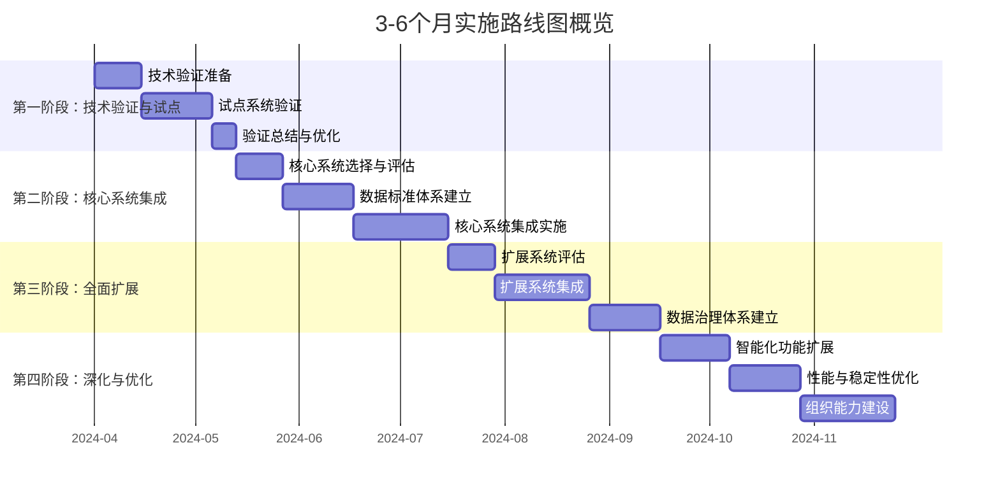

# 异构系统数据自动发现与标准化 - 3-6个月实施路线图

## 一、实施总体策略

### 1.1 实施愿景
通过RANGEN智能数据发现与标准化平台，在6个月内实现企业级数据治理能力，显著提升数据中台实施效率和数据质量。

### 1.2 核心目标
```yaml
6个月目标:
  技术目标:
    - 实现80%核心系统的自动化数据发现
    - 建立企业级数据标准体系
    - 自动化生成70%的数据集成代码
    
  业务目标:
    - 数据集成时间减少60%
    - 数据质量问题识别率提升80%
    - 数据标准制定周期缩短70%
    
  组织目标:
    - 建立数据治理委员会和流程
    - 培养内部数据治理专家团队
    - 形成数据驱动的决策文化
```

### 1.3 实施原则
1. **价值驱动原则**：优先实施业务价值高、见效快的系统
2. **渐进迭代原则**：小步快跑，持续验证和优化
3. **风险可控原则**：严格控制技术风险和业务风险
4. **组织协同原则**：业务、技术、管理多方协同

## 二、总体实施路线图

### 2.1 路线图概览


### 2.2 关键里程碑
| 里程碑 | 时间节点 | 交付物 | 成功标准 |
|--------|----------|--------|----------|
| **M1: 技术验证完成** | 第1个月末 | 技术验证报告、优化方案 | 验证成功率 > 85% |
| **M2: 核心标准建立** | 第2个月末 | 企业数据标准v1.0 | 标准覆盖核心业务实体 |
| **M3: 核心系统集成** | 第4个月中 | 3-5个核心系统集成 | 数据发现准确率 > 90% |
| **M4: 全面扩展启动** | 第5个月初 | 扩展计划、团队能力评估 | 团队掌握关键技术 |
| **M5: 治理体系建立** | 第6个月末 | 完整数据治理体系 | 流程、组织、工具完备 |

## 三、第一阶段：技术验证与试点 (1个月)

### 3.1 阶段目标
验证RANGEN数据发现模块的技术可行性，建立实施信心，优化实施方案。

### 3.2 详细计划
```yaml
第1-2周: 准备与部署
  任务:
    - 环境部署和配置
    - 试点系统选择确认
    - 团队组建和培训
    - 测试数据准备
  
  交付物:
    - 部署文档和环境配置
    - 试点系统信息表
    - 团队培训材料
    - 测试数据集

第3-4周: 验证执行
  任务:
    - 连接性验证测试
    - Schema发现功能验证
    - 数据质量评估验证
    - 标准建议功能验证
  
  交付物:
    - 连接验证报告
    - 功能验证报告
    - 性能测试报告
    - 问题跟踪清单

第5周: 总结优化
  任务:
    - 验证结果分析
    - 实施方案优化
    - 下一阶段规划
    - 汇报和决策
  
  交付物:
    - 技术验证总结报告
    - 优化后的实施方案
    - 第二阶段详细计划
    - 决策支持材料
```

### 3.3 资源需求
```yaml
人力资源:
  - 项目经理: 1人 (25%时间)
  - 技术架构师: 1人 (50%时间)
  - 数据工程师: 2人 (100%时间)
  - 业务分析师: 1人 (50%时间)

技术资源:
  - 测试服务器: 8核16GB * 1台
  - 存储空间: 500GB
  - 网络带宽: 100Mbps
  - 监控工具: 基础监控套件

预算估算:
  - 人力成本: ¥80,000-100,000
  - 硬件成本: ¥20,000-30,000 (可使用现有资源)
  - 软件成本: ¥10,000-20,000 (开源工具为主)
  - 其他成本: ¥5,000-10,000
  总计: ¥115,000-160,000
```

## 四、第二阶段：核心系统集成 (2-3个月)

### 4.1 阶段目标
建立企业数据标准体系，完成3-5个核心业务系统的自动化数据发现和集成。

### 4.2 详细计划
```yaml
第1-2周: 核心系统评估
  任务:
    - 核心系统技术评审
    - 业务价值评估
    - 集成复杂度评估
    - 优先级排序
  
  交付物:
    - 核心系统技术评审报告
    - 实施优先级矩阵
    - 详细实施计划

第3-6周: 数据标准体系建立
  任务:
    - 企业数据标准制定
    - 命名规范定义
    - 数据类型标准化
    - 质量规则定义
  
  交付物:
    - 企业数据标准v1.0
    - 数据字典和业务术语表
    - 质量规则库

第7-12周: 核心系统集成实施
  任务:
    - 系统1: CRM系统集成
    - 系统2: 电商平台集成
    - 系统3: ERP系统集成
    - 系统4-5: 根据评估选择
  
  交付物:
    - 各系统集成报告
    - 自动化生成的代码库
    - 数据质量评估报告
    - 运维监控体系
```

### 4.3 核心系统选择建议
基于技术验证结果和业务价值，建议优先集成以下系统：

| 系统 | 业务价值 | 技术可行性 | 实施复杂度 | 优先级 |
|------|----------|------------|------------|--------|
| **CRM系统** | 极高 | 高 | 中 | P0 |
| **电商平台** | 极高 | 高 | 中 | P0 |
| **ERP系统** | 极高 | 中 | 高 | P1 |
| **财务系统** | 高 | 中 | 高 | P1 |
| **OA系统** | 中 | 高 | 低 | P2 |

### 4.4 资源需求
```yaml
人力资源:
  - 项目经理: 1人 (50%时间)
  - 技术架构师: 1人 (100%时间)
  - 数据工程师: 3人 (100%时间)
  - 业务分析师: 2人 (100%时间)
  - 系统管理员: 1人 (50%时间)

技术资源:
  - 生产服务器: 16核32GB * 2台 (主备)
  - 存储空间: 2TB
  - 网络带宽: 500Mbps
  - 监控工具: 完整监控体系

预算估算:
  - 人力成本: ¥300,000-400,000
  - 硬件成本: ¥80,000-120,000
  - 软件成本: ¥30,000-50,000
  - 培训成本: ¥20,000-30,000
  - 其他成本: ¥10,000-20,000
  总计: ¥440,000-620,000
```

## 五、第三阶段：全面扩展 (2-3个月)

### 5.1 阶段目标
将数据发现能力扩展到剩余系统，建立完整的数据治理体系。

### 5.2 详细计划
```yaml
第1-2周: 扩展系统评估
  任务:
    - 剩余系统技术评估
    - 集成复杂度分析
    - 资源需求评估
    - 详细实施计划
  
  交付物:
    - 扩展系统评估报告
    - 资源需求计划
    - 详细实施时间表

第3-8周: 系统集成扩展
  任务:
    - 批量系统集成实施
    - 自动化流程优化
    - 性能优化和调优
    - 异常处理机制完善
  
  交付物:
    - 各系统集成报告
    - 性能优化报告
    - 自动化工具集
    - 运维手册

第9-12周: 数据治理体系建立
  任务:
    - 数据治理流程定义
    - 数据质量监控体系
    - 数据安全管控体系
    - 数据资产目录建设
  
  交付物:
    - 数据治理流程手册
    - 数据质量监控面板
    - 数据安全策略文档
    - 数据资产目录
```

### 5.3 扩展策略
```yaml
扩展策略:
  按技术栈分组:
    组1: Java技术栈系统 (3-5个系统)
    组2: .NET技术栈系统 (2-3个系统)
    组3: Python技术栈系统 (2-3个系统)
    组4: SaaS平台系统 (3-4个系统)
  
  按数据特性分组:
    组A: 事务型数据系统
    组B: 分析型数据系统
    组C: 主数据系统
  
  实施方式:
    并行实施: 技术栈相似的组并行实施
    串行实施: 技术差异大的组串行实施
    混合实施: 根据资源情况灵活调整
```

### 5.4 资源需求
```yaml
人力资源:
  - 项目经理: 1人 (75%时间)
  - 技术架构师: 2人 (100%时间)
  - 数据工程师: 4人 (100%时间)
  - 业务分析师: 2人 (100%时间)
  - 系统管理员: 2人 (100%时间)
  - 数据治理专员: 1人 (100%时间)

技术资源:
  - 扩展服务器: 按需扩展
  - 存储空间: 5TB+
  - 网络带宽: 1Gbps+
  - 监控工具: 企业级监控体系

预算估算:
  - 人力成本: ¥600,000-800,000
  - 硬件成本: ¥150,000-250,000
  - 软件成本: ¥50,000-100,000
  - 培训成本: ¥30,000-50,000
  - 其他成本: ¥20,000-40,000
  总计: ¥850,000-1,240,000
```

## 六、第四阶段：深化与优化 (1-2个月)

### 6.1 阶段目标
深化智能化功能，优化系统性能和稳定性，建立组织持续改进能力。

### 6.2 详细计划
```yaml
第1-3周: 智能化功能扩展
  任务:
    - AI增强的数据分类
    - 智能异常检测
    - 自动化优化建议
    - 预测性维护
  
  交付物:
    - 智能化功能模块
    - AI模型训练报告
    - 智能化效果评估

第4-6周: 性能与稳定性优化
  任务:
    - 系统性能调优
    - 高可用架构优化
    - 灾难恢复机制
    - 安全加固
  
  交付物:
    - 性能优化报告
    - 高可用架构设计
    - 灾难恢复方案
    - 安全评估报告

第7-8周: 组织能力建设
  任务:
    - 知识转移和培训
    - 最佳实践总结
    - 持续改进机制
    - 运营管理体系
  
  交付物:
    - 培训材料和认证
    - 最佳实践手册
    - 持续改进流程
    - 运营管理手册
```

### 6.3 深化功能规划
```yaml
智能化深化方向:
  智能数据分类:
    - 基于机器学习的数据敏感性自动分类
    - 业务含义自动推断和标签生成
    - 异常模式自动识别
  
  自动化优化:
    - 数据质量问题的自动修复建议
    - 性能瓶颈的自动识别和优化
    - 成本优化的自动建议
  
  预测性能力:
    - 数据质量趋势预测
    - 系统性能趋势预测
    - 资源需求预测
```

### 6.4 资源需求
```yaml
人力资源:
  - 项目经理: 1人 (50%时间)
  - 技术架构师: 1人 (100%时间)
  - 数据工程师: 2人 (100%时间)
  - AI工程师: 1人 (100%时间)
  - 运维工程师: 1人 (100%时间)

技术资源:
  - AI训练资源: GPU服务器 (可选)
  - 监控优化: 高级监控工具
  - 安全工具: 安全扫描和加固工具

预算估算:
  - 人力成本: ¥200,000-300,000
  - 硬件成本: ¥50,000-100,000 (GPU可选)
  - 软件成本: ¥30,000-60,000
  - 培训成本: ¥20,000-40,000
  总计: ¥300,000-500,000
```

## 七、总体资源与预算

### 7.1 总体资源需求
```yaml
6个月总体资源:
  人力资源 (人月):
    - 项目管理: 4-6人月
    - 技术架构: 8-10人月
    - 数据工程: 30-40人月
    - 业务分析: 10-12人月
    - 系统运维: 6-8人月
    - 其他支持: 4-6人月
    总计: 62-82人月
  
  技术资源:
    - 服务器: 4-6台 (按阶段扩展)
    - 存储: 10TB+ (按需扩展)
    - 网络: 1Gbps+ 带宽
    - 软件工具: 开源为主，商业工具按需
  
  时间资源:
    - 总时长: 6个月 (24周)
    - 关键会议: 每周技术评审，每月管理汇报
    - 里程碑节点: 5个关键里程碑
```

### 7.2 总体预算估算
```yaml
6个月总体预算:
  人力成本: ¥1,180,000-1,600,000
    技术验证阶段: ¥115,000-160,000
    核心集成阶段: ¥440,000-620,000
    全面扩展阶段: ¥850,000-1,240,000
    深化优化阶段: ¥300,000-500,000
  
  硬件成本: ¥300,000-500,000
    服务器: ¥200,000-350,000
    存储: ¥80,000-120,000
    网络: ¥20,000-30,000
  
  软件成本: ¥120,000-230,000
    商业软件: ¥80,000-150,000 (按需)
    开源工具: ¥0 (主要使用开源)
    云服务: ¥40,000-80,000 (可选)
  
  其他成本: ¥100,000-180,000
    培训: ¥50,000-90,000
    差旅: ¥20,000-40,000
    其他: ¥30,000-50,000
  
  总预算范围: ¥1,700,000-2,510,000
  
预算优化建议:
  1. 分阶段投入，降低初期资金压力
  2. 优先使用开源工具，控制软件成本
  3. 充分利用现有硬件资源
  4. 内部团队培养，降低外部依赖
```

### 7.3 投资回报分析
```yaml
投资回报计算:
  直接收益:
    - 数据集成时间减少: 60% (节约成本)
    - 数据质量问题减少: 50% (减少损失)
    - 决策效率提升: 40% (业务价值)
  
  间接收益:
    - 数据资产价值提升
    - 合规性风险降低
    - 组织数据能力提升
  
  ROI计算 (示例):
    投资成本: ¥2,000,000
    年度收益: ¥3,000,000 (保守估计)
    投资回收期: 8个月
    3年投资回报率: 350%
```

## 八、风险管理与应对

### 8.1 技术风险
| 风险项 | 概率 | 影响 | 应对措施 | 责任人 |
|--------|------|------|----------|--------|
| 系统兼容性问题 | 中 | 高 | 1. 技术验证阶段充分测试 2. 备选方案准备 3. 厂商技术支持 | 技术架构师 |
| 性能不达标 | 中 | 中 | 1. 性能基准测试 2. 优化方案准备 3. 分布式架构支持 | 数据工程师 |
| 数据安全风险 | 高 | 高 | 1. 数据脱敏策略 2. 访问控制严格化 3. 安全审计完整 | 安全负责人 |

### 8.2 业务风险
| 风险项 | 概率 | 影响 | 应对措施 | 责任人 |
|--------|------|------|----------|--------|
| 业务部门不配合 | 中 | 高 | 1. 高层支持 2. 业务价值沟通 3. 试点成功展示 | 项目经理 |
| 需求变更频繁 | 高 | 中 | 1. 敏捷迭代 2. 变更控制流程 3. 优先级管理 | 业务分析师 |
| 资源冲突 | 中 | 中 | 1. 资源协调 2. 优先级明确 3. 备选计划 | 项目经理 |

### 8.3 组织风险
| 风险项 | 概率 | 影响 | 应对措施 | 责任人 |
|--------|------|------|----------|--------|
| 团队技能不足 | 高 | 中 | 1. 培训计划 2. 知识传递 3. 外部专家支持 | 技术架构师 |
| 关键人员流失 | 低 | 高 | 1. 知识文档化 2. 团队备份 3. 激励机制 | 项目经理 |
| 跨部门协作不畅 | 中 | 中 | 1. 定期沟通机制 2. 共同目标设定 3. 高层协调 | 项目经理 |

### 8.4 实施风险
| 风险项 | 概率 | 影响 | 应对措施 | 责任人 |
|--------|------|------|----------|--------|
| 项目延期 | 高 | 中 | 1. 缓冲时间安排 2. 关键路径管理 3. 定期进度检视 | 项目经理 |
| 预算超支 | 中 | 中 | 1. 预算控制机制 2. 变更审批流程 3. 成本监控 | 项目经理 |
| 质量不达标 | 中 | 高 | 1. 质量检查点 2. 验收标准明确 3. 持续改进 | 质量负责人 |

## 九、成功度量与验收

### 9.1 技术成功指标
```yaml
技术指标:
  数据发现能力:
    - Schema发现准确率: > 90%
    - 连接成功率: > 95%
    - 数据质量评估覆盖度: > 85%
  
  系统性能:
    - 单表分析时间: < 30秒
    - 系统可用性: > 99.5%
    - API响应时间(P95): < 200ms
  
  自动化程度:
    - 标准文档自动生成率: > 70%
    - 映射代码自动生成率: > 60%
    - 质量规则自动生成率: > 50%
```

### 9.2 业务成功指标
```yaml
业务指标:
  效率提升:
    - 数据集成时间减少: > 60%
    - 标准制定周期缩短: > 70%
    - 问题识别时间减少: > 50%
  
  质量改进:
    - 数据完整性提升: > 30%
    - 数据一致性提升: > 40%
    - 问题解决率提升: > 80%
  
  价值创造:
    - 数据产品上线速度提升: > 50%
    - 决策支持度提升: > 40%
    - 用户满意度: > 4.2/5.0
```

### 9.3 组织成功指标
```yaml
组织指标:
  能力建设:
    - 团队技能认证通过率: > 80%
    - 知识文档完整度: > 90%
    - 最佳实践采纳率: > 70%
  
  流程成熟度:
    - 数据治理流程覆盖度: > 80%
    - 流程执行合规率: > 90%
    - 持续改进机制有效性: > 80%
  
  文化转变:
    - 数据驱动决策比例: > 60%
    - 跨部门协作满意度: > 4.0/5.0
    - 数据治理认知度: > 85%
```

### 9.4 验收标准
```yaml
项目验收条件:
  必须满足条件:
    - 所有核心功能通过验收测试
    - 技术指标达到目标值的80%以上
    - 业务指标达到目标值的70%以上
    - 无严重安全漏洞和数据泄露
  
  期望满足条件:
    - 技术指标达到目标值的90%以上
    - 业务指标达到目标值的80%以上
    - 用户满意度 > 4.0/5.0
    - 建立可持续的运营体系
  
  优秀表现:
    - 技术指标超额完成 (110%+)
    - 业务价值显著超出预期
    - 形成可复用的最佳实践
    - 获得业务部门主动推广
```

## 十、下一步行动建议

### 10.1 立即行动项
```bash
# 1. 项目启动准备
#   - 成立项目指导委员会
#   - 确认项目预算和资源
#   - 制定详细的项目章程

# 2. 团队组建
#   - 确认核心团队成员
#   - 安排启动培训和知识传递
#   - 建立沟通和协作机制

# 3. 环境准备
#   - 准备测试和生产环境
#   - 配置监控和日志系统
#   - 建立备份和恢复机制

# 4. 试点系统确认
#   - 最终确认2-3个试点系统
#   - 获取必要的访问权限
#   - 准备测试数据和用例
```

### 10.2 第一阶段详细计划
```yaml
第1周详细安排:
  周一: 项目启动会议，明确目标和分工
  周二: 环境部署和配置
  周三: 团队技术培训
  周四: 试点系统接入准备
  周五: 测试用例设计和准备
  
第2周详细安排:
  周一: 连接性验证测试开始
  周二: Schema发现功能测试
  周三: 数据质量评估测试
  周四: 标准建议功能测试
  周五: 中期进展汇报
  
第3周详细安排:
  周一: 性能测试和优化
  周二: 异常处理测试
  周三: 集成测试
  周四: 问题修复和优化
  周五: 验证总结和报告
```

### 10.3 沟通与汇报机制
```yaml
沟通机制:
  每日站会: 15分钟，团队进度同步
  每周技术评审: 1小时，技术问题讨论
  每两周管理汇报: 30分钟，进展汇报
  每月指导委员会会议: 1小时，决策支持
  
汇报内容:
  进展汇报: 完成工作、当前进度、下一步计划
  问题汇报: 遇到问题、影响分析、解决建议
  风险汇报: 识别风险、影响评估、应对措施
  成果展示: 关键成果、业务价值、用户反馈
  
文档管理:
  项目文档: 集中式文档库，实时更新
  代码管理: Git版本控制，代码审查
  知识库: 最佳实践、问题解决方案、培训材料
```

---

**文档版本**: 1.0.0  
**创建日期**: 2026-03-09  
**更新计划**: 根据项目进展每月更新  
**适用对象**: 项目管理层、实施团队、业务相关部门  
**保密等级**: 内部使用  

## 总结

本实施路线图提供了完整的3-6个月异构系统数据自动发现与标准化项目实施计划，涵盖：

1. **清晰的阶段划分**：技术验证 → 核心集成 → 全面扩展 → 深化优化
2. **详细的实施计划**：每周任务安排、交付物定义、资源需求
3. **全面的风险管理**：技术、业务、组织、实施风险识别和应对
4. **明确的成功度量**：技术、业务、组织三个维度的成功指标
5. **实用的操作指南**：立即行动项、详细计划、沟通机制

通过本路线图的实施，预计在6个月内实现：
- **技术层面**：自动化数据发现能力覆盖80%核心系统
- **业务层面**：数据集成效率提升60%，数据质量显著改善
- **组织层面**：建立可持续的数据治理体系和团队能力

**建议立即启动第一阶段技术验证工作**，为后续大规模实施奠定坚实基础。<mccoremem id="jxyhcxh2ou55wz9vuk1nfyigf" />