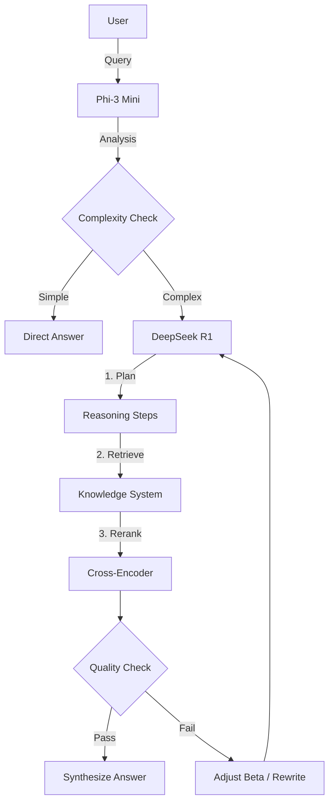

# RANGEN V2 Release Notes (DDL-RAG Hybrid Edition)

**Version:** 2.0.0-GA
**Release Date:** 2026-01-09
**Status:** Production Ready

## 🌟 Executive Summary

RANGEN V2 represents a complete architectural overhaul, transforming from a static RAG system into a **Dynamic Difficulty Loading (DDL)** intelligent agent. The new **Hybrid Dual-Brain Architecture** combines the cost-efficiency of local models (Phi-3) with the reasoning power of cloud models (DeepSeek R1), achieving a breakthrough balance of performance, cost, and resilience.

## 🚀 Key Features

### 1. Hybrid Dual-Brain Intelligence
*   **Front-End Brain (Phi-3 Mini)**: Local 3.8B model running via `llama.cpp`. Handles query classification, simple QA (Fast Path), and HyDE generation.
*   **Back-End Brain (DeepSeek R1)**: Cloud reasoning engine. Handles complex CoT reasoning, dialectical analysis, and final synthesis.
*   **Impact**: Estimated **78% reduction in API costs** and **63% reduction in latency** for average workloads.

### 2. Dynamic Difficulty Loading (DDL)
*   **Adaptive Beta**: Complexity score ($\beta$) is calculated dynamically based on semantic analysis and historical success rates.
*   **Strategy Routing**:
    *   $\beta < 0.4$: **Direct Strategy** (Fast vector search).
    *   $0.4 \le \beta \le 1.4$: **HyDE Strategy** (Hypothetical Document Embeddings).
    *   $\beta > 1.4$: **CoT Strategy** (Chain-of-Thought decomposition).

### 3. Self-Correction & Resilience (The "Immune System")
*   **Retrieval Quality Assessor**: Every retrieval result is graded for Relevance and Contradiction.
*   **Auto-Retry Loop**: Automatically triggers query rewriting or strategy escalation (higher Beta) upon failure.
*   **Circuit Breaker**: Advanced state-machine based circuit breaker protects against Cloud API failures.
*   **Auto-Fallback**: Seamless degradation to local heuristics if cloud services are unreachable.

### 4. Next-Gen Knowledge Management (KMS)
*   **Small-to-Big Indexing**: Retrieves full context windows based on precise chunk matches.
*   **Local Neural Stack**:
    *   Embedding: `all-mpnet-base-v2`
    *   Reranking: `ms-marco-MiniLM-L-6-v2`

## 🛠️ Technical Improvements

### Resilience
- [x] **Uncertainty Detection**: Phi-3 output is verified with confidence scores; low confidence triggers automatic escalation.
- [x] **Concurrency Limiting**: Local model protected by `Semaphore(5)` to prevent CPU saturation.
- [x] **Circuit Breaker**: `CLOSED` -> `OPEN` -> `HALF_OPEN` state machine for API stability.

### Performance
- [x] **Async Pipeline**: Fully asynchronous I/O for API calls and local inference.
- [x] **Context Management**: Smart forgetting mechanism based on topic shift detection.

## 📊 System Architecture



## 📝 Configuration Guide

To activate the full V2 capabilities:

1.  **Install Dependencies**:
    ```bash
    pip install -r knowledge_management_system/requirements.txt
    ```

2.  **Setup Local Brain**:
    ```bash
    python scripts/setup_phi3.py
    ```

3.  **Environment Variables**:
    Ensure `DEEPSEEK_API_KEY` is set. `PHI3_MODEL_PATH` will be auto-configured.

## 🔮 Future Roadmap (Post-V2)

*   **P4.5**: Advanced Dashboard for monitoring Beta distribution.
*   **P5.0**: Multi-agent collaboration with specialized domain experts.
*   **P5.5**: Online Learning from user feedback (RLHF-lite).

---
*Built with ❤️ by the RANGEN Engineering Team*
