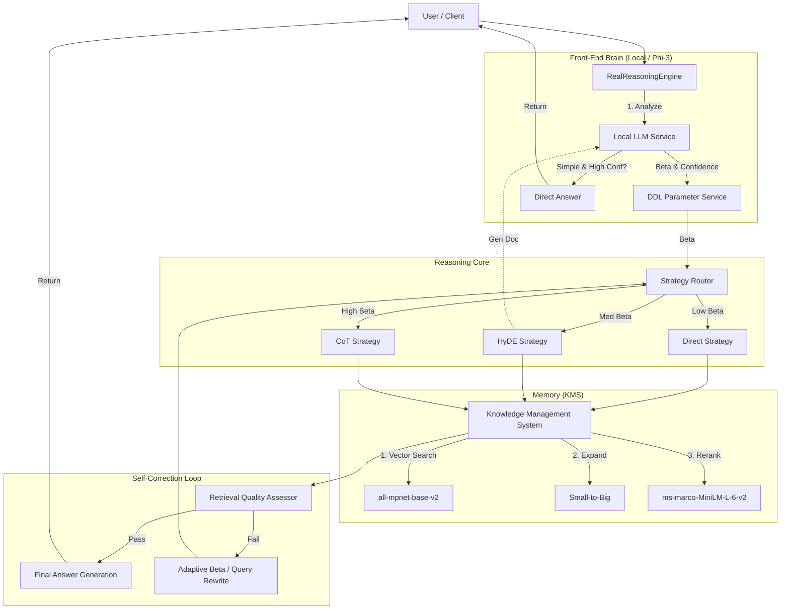

# RANGEN V2 System Architecture (DDL-RAG Hybrid)

RANGEN V2 implements a **Dynamic Difficulty Loading (DDL)** architecture, enhanced with a **Tiered Intelligence** strategy. It dynamically adapts its reasoning strategy based on query complexity and features a "Dual-Brain" design to balance performance, cost, and accuracy.

## 1. High-Level Architecture

The system operates on a **Hybrid Dual-Brain** model:
1.  **Front-End Brain (Local)**: **Phi-3 Mini**. Handles simple queries, routing, and pre-processing.
2.  **Back-End Brain (Cloud)**: **DeepSeek Reasoner (R1)**. Handles complex reasoning, decision making, and synthesis.



## 2. Core Components

### 2.1 Reasoning Core (`src/core/`)
The central nervous system of RANGEN.

*   **RealReasoningEngine** (`real_reasoning_engine.py`):
    *   **Role**: Main orchestrator.
    *   **Logic**: Coordinates the interaction between Local LLM, DDL Service, and Retrieval Strategies.
    *   **Resilience (P4)**: Implements **Circuit Breaker** logic. If DeepSeek fails, it automatically degrades to heuristic evaluation to ensure service continuity.
    *   **Resource Management (P4.5)**: Uses **SmartModelManager** for lazy loading and LRU eviction of AI models.

*   **Local LLM Service** (`src/services/local_llm_service.py`) **[New in P3]**:
    *   **Model**: `Phi-3-mini-4k-instruct-gguf` (Local, Quantized).
    *   **Role**:
        *   **Gatekeeper**: Calculates complexity (Beta) and filters simple queries.
        *   **Uncertainty Detection (P4)**: Checks confidence. If Phi-3 is unsure (`conf < 0.7`), forces upgrade to DeepSeek even for simple queries.
        *   **Fast Path**: Directly answers trivial questions (Zero API Cost).
        *   **Preprocessor**: Generates HyDE documents for complex queries.
    *   **Optimization**: Managed by `SmartModelManager` to release memory when idle.

*   **DDL Service** (`src/core/ddl/`):
    *   **DDLParameterService**: Calculates the **Beta** value (complexity score) by fusing Phi-3's semantic analysis with heuristic rules.
    *   **AdaptiveBetaThreshold**: Dynamically adjusts strategy switching thresholds based on historical success rates.

### 2.2 Retrieval Strategies (`src/core/reasoning/retrieval_strategies/`)
Strategies selected based on Beta value:

1.  **Direct Strategy** (Low Beta): Simple vector search.
2.  **HyDE Strategy** (Medium Beta): Uses Phi-3 to generate a hypothetical document, then retrieves based on that vector.
3.  **CoT Strategy** (High Beta): Decomposes complex questions into sub-steps (Plan-and-Solve) using DeepSeek R1.

### 2.3 Knowledge Management System (`knowledge_management_system/`)
A standalone, high-performance retrieval engine.

*   **Indexing**: Uses **Small-to-Big** strategy (indices small chunks, retrieves parent windows).
*   **Embedding**: `sentence-transformers/all-mpnet-base-v2` (Local, 768d).
*   **Reranking**: `cross-encoder/ms-marco-MiniLM-L-6-v2` (Local).
*   **Fallback**: Graph RAG -> Vector -> Core Facts (Deprecated).

## 3. AI Technology Stack

| Component | Model / Technology | Deployment | Role |
| :--- | :--- | :--- | :--- |
| **Cloud Brain** | **DeepSeek Reasoner (R1)** | API | Complex Reasoning, CoT, Quality Assessment |
| **Local Brain** | **Phi-3 Mini (3.8B)** | Local (llama.cpp) | Routing, Simple QA, HyDE Generation |
| **Embedding** | **all-mpnet-base-v2** | Local (CPU/MPS) | Vectorization |
| **Reranking** | **ms-marco-MiniLM-L-6-v2** | Local (CPU/MPS) | Precision Sorting |

## 4. Key Workflows

### 4.1 The "Fast Path" (Simple Query)
1.  User Query -> `LocalLLMService`.
2.  Phi-3 analyzes: `Beta < 0.4` & `is_simple=True` & **`Confidence > 0.7`**.
3.  Phi-3 generates answer directly.
4.  **Result**: < 1s latency, $0 cost.

### 4.2 The "Deep Path" (Complex Query)
1.  User Query -> `LocalLLMService` -> `Beta > 1.4` (or Low Confidence).
2.  **DDL** selects **CoT Strategy**.
3.  **DeepSeek R1** breaks down query into steps.
4.  **KMS** retrieves evidence for each step (using Rerank).
5.  **Quality Assessor** checks evidence (Pass/Fail).
6.  **DeepSeek R1** synthesizes final answer.

### 4.3 Self-Correction Loop
1.  If **Quality Assessor** detects "Contradiction" or "Low Relevance":
2.  System triggers **Retry**:
    *   Increases Beta (forcing deeper reasoning).
    *   Rewrites Query (using Phi-3).
3.  Re-executes retrieval with adjusted parameters.

## 5. Directory Structure

```text
src/
├── core/
│   ├── real_reasoning_engine.py    # Main Entry Point (Circuit Breaker)
│   ├── llm_integration.py          # DeepSeek Client
│   ├── ddl/                        # Dynamic Difficulty Loading
│   └── reasoning/
│       └── retrieval_strategies/   # Direct, HyDE, CoT, Assessor
├── services/
│   ├── local_llm_service.py        # Phi-3 Service (Confidence Check)
│   └── knowledge_retrieval_service.py # KMS Bridge
└── knowledge_management_system/    # Independent Retrieval Engine
    ├── core/
    ├── modalities/                 # Embedding (TextProcessor)
    └── config/                     # system_config.json
```
