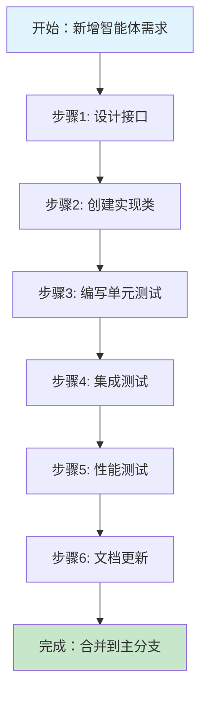
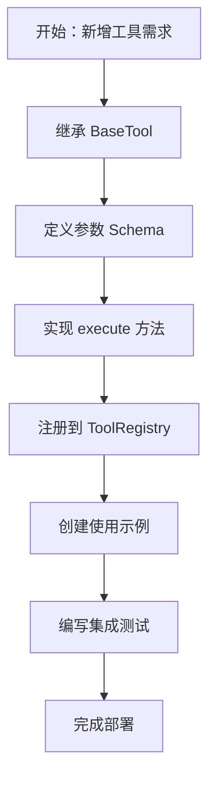

# RANGEN 系统规范 
## Research Agent Generation Engine 

> **版本**: 1.0.0  
> **生效日期**: 2024-06-01  
> **维护者**: RANGEN Core Team 

--- 

## 1. 项目定义 (Project Definition) 

### 1.1 系统概述 

**名称**: RANGEN (Research Agent Generation Engine)  
**类型**: 自主化研究与推理的多智能体系统  
**状态**: Production (v1.0.0) 

**核心愿景**: 
> 构建一个能够自主完成复杂研究任务、具备深度推理能力、可扩展且可观测的智能体系统。 

### 1.2 核心能力矩阵 

| 能力 | 描述 | 实现组件 | 
|------|------|----------| 
| **深度推理** | 多步骤思维链、反思、验证 | `ReasoningAgent`, `ValidationAgent` | 
| **知识检索** | 多源RAG、相关性评估 | `RetrievalAgent`, `RerankTool` | 
| **任务编排** | 动态工作流、条件分支 | `ExecutionCoordinator` (LangGraph) | 
| **上下文管理** | 会话记忆、状态持久化 | `ContextManager`, `MemoryAgent` | 
| **可观测性** | 监控、追踪、调试 | `PerformanceMonitor`, `ErrorHandler` | 
| **扩展性** | 插件化架构、热加载 | `ToolRegistry`, `ConfigurableRouter` | 

### 1.3 技术栈定义 (Technical Stack)

| 类别 | 技术/库 | 用途 | 备注 |
|------|---------|------|------|
| **语言** | Python 3.10+ | 核心开发语言 | 强类型提示 |
| **LLM 框架** | LangGraph / LangChain | 智能体编排与工作流 | 支持有环图与持久化状态 |
| **向量存储** | FAISS | 高效向量检索 | 本地部署，支持大规模数据 |
| **Embedding** | HuggingFace (sentence-transformers) | 文本向量化 | 本地模型，无API依赖 |
| **配置管理** | YAML / Pydantic | 强类型配置加载 | 运行时验证 |
| **测试框架** | Pytest | 单元与集成测试 | 异步支持 (`pytest-asyncio`) |

### 1.4 设计原则 

1. **单一职责**: 每个组件只做一件事，且做好 
2. **明确接口**: 先定义接口，再实现具体类 
3. **依赖注入**: 通过构造函数注入依赖，避免全局状态 
4. **可观测性**: 所有关键路径都有监控和日志 
5. **渐进增强**: 支持从简单到复杂的平滑升级 

--- 

## 2. 资源组织结构 (Repository Structure) 

### 2.1 标准目录布局 

``` 
rangen/ 
├── src/ 
│   ├── agents/                 # 智能体实现 
│   │   ├── base_agent.py       # 智能体基类 
│   │   ├── reasoning_agent.py  # 推理智能体 
│   │   ├── retrieval_agent.py  # 检索智能体 
│   │   ├── generation_agent.py # 生成智能体 
│   │   ├── validation_agent.py # 验证智能体 
│   │   ├── citation_agent.py   # 引用智能体 
│   │   └── memory_agent.py     # 记忆智能体 
│   │ 
│   ├── agents/tools/           # 技能/工具 
│   │   ├── base_tool.py        # 工具基类 
│   │   ├── tool_registry.py    # 工具注册中心 
│   │   ├── retrieval_tool.py   # 检索工具 
│   │   ├── reasoning_tool.py   # 推理工具 
│   │   ├── generation_tool.py  # 生成工具 
│   │   └── citation_tool.py    # 引用工具 
│   │ 
│   ├── core/                   # 核心引擎 
│   │   ├── configurable_router.py     # 可配置路由 
│   │   ├── execution_coordinator.py   # 执行编排器 
│   │   ├── context_manager.py         # 上下文管理器 
│   │   └── workflows/          # 工作流定义 
│   │       ├── react_workflow.py 
│   │       ├── cot_workflow.py 
│   │       └── direct_workflow.py 
│   │ 
│   ├── interfaces/             # 接口定义 
│   │   ├── router.py          # 路由接口 
│   │   ├── coordinator.py     # 编排器接口 
│   │   ├── agent.py           # 智能体接口 
│   │   ├── tool.py            # 工具接口 
│   │   └── context.py         # 上下文接口 
│   │ 
│   ├── services/              # 基础设施服务 
│   │   ├── performance_monitor.py    # 性能监控 
│   │   ├── error_handler.py          # 错误处理 
│   │   ├── cache_service.py          # 缓存服务 
│   │   └── logging_service.py        # 日志服务 
│   │ 
│   ├── models/                # 数据模型 
│   │   ├── query.py          # 查询模型 
│   │   ├── task.py           # 任务模型 
│   │   ├── agent_result.py   # 智能体结果 
│   │   └── execution_result.py # 执行结果 
│   │ 
│   ├── knowledge_management_system/  # 知识库管理 
│   │   ├── vector_store.py   # 向量存储 
│   │   ├── document_loader.py # 文档加载 
│   │   └── retriever.py      # 检索器 
│   │ 
│   └── prompts/              # 提示词管理 
│       ├── reasoning/        # 推理提示词 
│       ├── retrieval/        # 检索提示词 
│       └── generation/       # 生成提示词 
│ 
├── tests/                    # 测试目录 
│   ├── unit/                # 单元测试 
│   ├── integration/         # 集成测试 
│   └── e2e/                 # 端到端测试 
│ 
├── scripts/                  # 工具脚本 
│   ├── migrate.py           # 迁移脚本 
│   ├── benchmark.py         # 性能测试 
│   └── deploy.py            # 部署脚本 
│ 
├── config/                   # 配置文件 
│   ├── development.yaml     # 开发环境配置 
│   ├── production.yaml      # 生产环境配置 
│   └── agents_config.yaml   # 智能体配置 
│ 
├── docs/                    # 文档 
│   ├── api/                # API文档 
│   ├── architecture/       # 架构文档 
│   └── guides/             # 使用指南 
│ 
├── examples/                # 示例代码 
│   ├── basic_usage.py      # 基础用法 
│   ├── custom_agent.py     # 自定义智能体 
│   └── custom_workflow.py  # 自定义工作流 
│ 
└── docker/                  # Docker配置 
    ├── Dockerfile 
    └── docker-compose.yaml 
``` 

### 2.2 模块依赖规范 

``` 
┌─────────────────┐ 
│  Client/API     │ 
└────────┬────────┘ 
         │ 
┌────────▼────────┐ 
│ ConfigurableRouter │ ← 唯一入口 
└────────┬────────┘ 
         │ 
┌────────▼────────┐ 
│ ContextManager  │ ← 状态管理 
└────────┬────────┘ 
         │ 
┌────────▼────────┐ 
│ ExecutionCoordinator │ ← 流程编排 
└────────┬────────┘ 
         │ 
┌────────▼────────┐ 
│ Specialist Agents │ ← 业务逻辑 
└────────┬────────┘ 
         │ 
┌────────▼────────┐ 
│  Tool Registry  │ ← 工具抽象 
└────────┬────────┘ 
         │ 
┌────────▼────────┐ 
│  Tools/KMS API  │ ← 底层能力 
└─────────────────┘ 
``` 

**关键规则**: 
1. **单向依赖**: 上层可以依赖下层，下层不能依赖上层 
2. **接口编程**: 模块间通过接口通信，而非具体实现 
3. **依赖注入**: 所有依赖通过构造函数明确声明 

--- 

## 3. 开发规范 (Development Standards) 

### 3.1 智能体开发规范 (Agents) 

#### 3.1.1 基类要求 
```python 
# ✅ 正确示例 
from src.interfaces.agent import IAgent, AgentConfig, AgentResult 
from dataclasses import dataclass 
from typing import Dict, Any, Optional 
import logging 

@dataclass 
class MyAgentConfig(AgentConfig): 
    """自定义配置""" 
    custom_param: str = "default" 
    max_retries: int = 3 

class MySpecialistAgent(IAgent): 
    """我的专业智能体 
    
    职责描述: 
    - 处理特定领域的复杂任务 
    - 支持多步推理 
    - 提供详细的过程追踪 
    """ 
    
    def __init__(self, llm_client, tool_registry): 
        self.config = MyAgentConfig( 
            name="my_specialist_agent", 
            description="处理特定领域任务的智能体", 
            version="1.0.0" 
        ) 
        self.llm_client = llm_client 
        self.tool_registry = tool_registry 
        self.logger = logging.getLogger(__name__) 
        
    async def execute(self, inputs: Dict[str, Any], context: Optional[Dict] = None) -> AgentResult: 
        """执行智能体任务""" 
        start_time = time.time() 
        
        try: 
            # 1. 输入验证 
            self._validate_inputs(inputs) 
            
            # 2. 构建提示词 
            prompt = self._build_prompt(inputs, context) 
            
            # 3. 调用LLM 
            response = await self.llm_client.generate(prompt) 
            
            # 4. 处理输出 
            result = self._process_response(response) 
            
            execution_time = time.time() - start_time 
            
            return AgentResult( 
                agent_name=self.config.name, 
                output=result, 
                status=ExecutionStatus.COMPLETED, 
                execution_time=execution_time, 
                tokens_used=response.tokens_used, 
                metadata={"steps": ["validate", "prompt", "generate", "process"]} 
            ) 
            
        except Exception as e: 
            self.logger.error(f"Agent execution failed: {e}") 
            return AgentResult( 
                agent_name=self.config.name, 
                output=None, 
                status=ExecutionStatus.FAILED, 
                execution_time=time.time() - start_time, 
                error=str(e) 
            ) 
``` 

#### 3.1.2 命名规范 
- **文件名**: `snake_case` (如 `reasoning_expert.py`) 
- **类名**: `PascalCase` (如 `ReasoningExpert`) 
- **方法名**: `snake_case` (如 `execute_plan`) 
- **常量**: `UPPER_SNAKE_CASE` (如 `MAX_RETRIES`) 

#### 3.1.3 文档要求 
```python 
class ReasoningAgent(IAgent): 
    """推理智能体 
    
    Core Responsibility: 
    - 执行多步逻辑推理 
    - 生成思维链（Chain of Thought） 
    - 验证推理过程的逻辑一致性 
    
    Input Schema: 
    - query: str - 用户查询 
    - context: Dict - 执行上下文 
    - reasoning_type: str - 推理类型（cot, react, etc.） 
    
    Output Schema: 
    - reasoning_chain: List[str] - 推理步骤 
    - conclusion: str - 最终结论 
    - confidence: float - 置信度（0-1） 
    
    Example: 
    >>> agent = ReasoningAgent() 
    >>> result = await agent.execute({ 
    ...     "query": "证明勾股定理", 
    ...     "reasoning_type": "cot" 
    ... }) 
    """ 
``` 

### 3.2 工具开发规范 (Tools) 

#### 3.2.1 基类实现 
```python 
from src.interfaces.tool import ITool, ToolConfig, ToolResult, ToolCategory 
from pydantic import BaseModel, Field 
from typing import List, Optional 

class RetrievalParameters(BaseModel): 
    """检索工具参数模式""" 
    query: str = Field(..., description="检索查询") 
    top_k: int = Field(5, description="返回结果数量") 
    filters: Optional[Dict] = Field(None, description="过滤条件") 
    
class RetrievalTool(ITool): 
    """向量检索工具 
    
    用于从知识库中检索相关信息 
    """ 
    
    def __init__(self, vector_store): 
        self.config = ToolConfig( 
            name="retrieval_tool", 
            category=ToolCategory.RETRIEVAL, 
            description="从向量数据库中检索相关文档", 
            version="1.0.0", 
            timeout=30.0 
        ) 
        self.vector_store = vector_store 
        
    def get_parameters_schema(self) -> Dict[str, Any]: 
        """返回参数模式""" 
        return RetrievalParameters.schema() 
    
    def validate_parameters(self, **kwargs) -> bool: 
        """验证参数""" 
        try: 
            RetrievalParameters(**kwargs) 
            return True 
        except Exception: 
            return False 
    
    async def execute(self, **kwargs) -> ToolResult: 
        """执行检索""" 
        try: 
            # 参数验证 
            params = RetrievalParameters(**kwargs) 
            
            # 执行检索 
            start_time = time.time() 
            results = await self.vector_store.search( 
                query=params.query, 
                top_k=params.top_k, 
                filters=params.filters 
            ) 
            execution_time = time.time() - start_time 
            
            return ToolResult( 
                success=True, 
                output=results, 
                execution_time=execution_time, 
                metadata={ 
                    "query": params.query, 
                    "top_k": params.top_k, 
                    "result_count": len(results) 
                } 
            ) 
            
        except Exception as e: 
            return ToolResult( 
                success=False, 
                output=None, 
                error=str(e), 
                execution_time=time.time() - start_time 
            ) 
``` 

#### 3.2.2 工具注册 
```python 
# 在工具模块的 __init__.py 或专门的注册文件中 
from src.agents.tools.tool_registry import ToolRegistry 
from .retrieval_tool import RetrievalTool 
from .reasoning_tool import ReasoningTool 

def register_default_tools(registry: ToolRegistry, vector_store, llm_client): 
    """注册默认工具集""" 
    registry.register_tool(RetrievalTool(vector_store)) 
    registry.register_tool(ReasoningTool(llm_client)) 
    # ... 注册其他工具 
    
# 或者在工具类中使用装饰器 
@register_tool("retrieval_tool", category=ToolCategory.RETRIEVAL) 
class RetrievalTool(ITool): 
    """检索工具""" 
    # ... 实现 
``` 

### 3.3 提示词管理规范 (Prompts) 

#### 3.3.1 提示词提取原则 
```python 
# ❌ 避免：提示词硬编码在代码中 
async def execute(self, query: str): 
    prompt = f""" 
    请回答以下问题：{query} 
    要求： 
    1. 答案要准确 
    2. 不超过100字 
    """ 
    # ... 

# ✅ 推荐：提示词分离 
class ReasoningPrompts: 
    """推理提示词模板""" 
    
    COT_TEMPLATE = """ 
    # 任务：执行思维链推理 
    
    问题：{question} 
    
    请按以下步骤推理： 
    1. 理解问题核心 
    2. 分解问题为子问题 
    3. 逐步解决每个子问题 
    4. 整合答案 
    
    当前上下文： 
    {context} 
    
    要求： 
    - 每个步骤清晰标注 
    - 显示推理过程 
    - 最终给出明确结论 
    """ 
    
    REACT_TEMPLATE = """ 
    # 任务：ReAct 推理 
    
    问题：{question} 
    可用工具：{available_tools} 
    
    格式： 
    Thought: <你的思考> 
    Action: <要调用的工具> 
    Action Input: <工具输入> 
    Observation: <工具返回结果> 
    ...（重复直到问题解决） 
    Final Answer: <最终答案> 
    """ 
    
    @classmethod 
    def get_cot_prompt(cls, question: str, context: str = "") -> str: 
        """获取CoT提示词""" 
        return cls.COT_TEMPLATE.format( 
            question=question, 
            context=context 
        ) 
``` 

#### 3.3.2 提示词文件结构 
``` 
src/prompts/ 
├── __init__.py 
├── base.py                    # 基础模板 
├── reasoning/                 # 推理提示词 
│   ├── __init__.py 
│   ├── cot_templates.py      # 思维链模板 
│   ├── react_templates.py    # ReAct模板 
│   └── validation_templates.py # 验证模板 
├── retrieval/                 # 检索提示词 
│   ├── __init__.py 
│   ├── query_rewrite.py      # 查询重写 
│   └── rerank_templates.py   # 重排序模板 
├── generation/                # 生成提示词 
│   ├── __init__.py 
│   ├── answer_generation.py  # 答案生成 
│   └── citation_generation.py # 引用生成 
└── system/                    # 系统提示词 
    ├── __init__.py 
    ├── agent_instructions.py # 智能体指令 
    └── safety_guidelines.py  # 安全指南 
``` 

### 3.4 测试规范 (Testing) 

#### 3.4.1 单元测试要求 
```python 
# tests/unit/agents/test_reasoning_agent.py 
import pytest 
from unittest.mock import AsyncMock, MagicMock 
from src.agents.reasoning_agent import ReasoningAgent 

class TestReasoningAgent: 
    """推理智能体单元测试""" 
    
    @pytest.fixture 
    def mock_llm(self): 
        """模拟LLM客户端""" 
        llm = AsyncMock() 
        llm.generate.return_value = AsyncMock( 
            text="思考：这是一个测试问题...", 
            tokens_used=100 
        ) 
        return llm 
    
    @pytest.fixture 
    def agent(self, mock_llm): 
        """创建测试智能体""" 
        return ReasoningAgent(llm_client=mock_llm) 
    
    @pytest.mark.asyncio 
    async def test_execute_success(self, agent): 
        """测试成功执行""" 
        inputs = { 
            "query": "测试问题", 
            "reasoning_type": "cot" 
        } 
        
        result = await agent.execute(inputs) 
        
        # 断言结果 
        assert result.status == ExecutionStatus.COMPLETED 
        assert result.agent_name == "reasoning_agent" 
        assert result.execution_time > 0 
        assert "思考" in str(result.output) 
    
    @pytest.mark.asyncio 
    async def test_execute_with_invalid_input(self, agent): 
        """测试无效输入""" 
        inputs = { 
            "invalid_key": "value"  # 缺少必要字段 
        } 
        
        result = await agent.execute(inputs) 
        
        assert result.status == ExecutionStatus.FAILED 
        assert result.error is not None 
    
    @pytest.mark.parametrize("reasoning_type", ["cot", "react", "direct"]) 
    @pytest.mark.asyncio 
    async def test_different_reasoning_types(self, agent, reasoning_type): 
        """测试不同推理类型""" 
        inputs = { 
            "query": "测试问题", 
            "reasoning_type": reasoning_type 
        } 
        
        result = await agent.execute(inputs) 
        
        assert result.status == ExecutionStatus.COMPLETED 
``` 

#### 3.4.2 测试覆盖率要求 
```yaml 
# .coveragerc 
[run] 
source = src/ 
omit = 
    */__pycache__/* 
    */tests/* 
    */migrations/* 
    */venv/* 

[report] 
exclude_lines = 
    pragma: no cover 
    def __repr__ 
    raise AssertionError 
    raise NotImplementedError 
    if __name__ == .__main__.: 
    pass 

fail_under = 85  # 最低覆盖率要求 
``` 

### 3.5 代码质量规范 

#### 3.5.1 类型提示要求 
```python 
# ✅ 正确：完整的类型提示 
from typing import Dict, List, Optional, Union, AsyncGenerator 
from pydantic import BaseModel 

class TaskInput(BaseModel): 
    """任务输入模型""" 
    query: str 
    user_id: Optional[str] = None 
    metadata: Dict[str, Union[str, int, float]] = {} 

async def process_task( 
    task: TaskInput, 
    max_retries: int = 3 
) -> Dict[str, Union[str, List[str]]]: 
    """处理任务 
    
    Args: 
        task: 任务输入 
        max_retries: 最大重试次数 
        
    Returns: 
        处理结果，包含答案和引用 
        
    Raises: 
        ValueError: 当输入无效时 
        TimeoutError: 当执行超时时 
    """ 
    if not task.query: 
        raise ValueError("查询不能为空") 
    
    # ... 实现逻辑 
``` 

#### 3.5.2 代码格式化配置 
```toml 
# pyproject.toml 
[tool.black] 
line-length = 88 
target-version = ['py38', 'py39', 'py310'] 
include = '\.pyi?$' 
extend-exclude = ''' 
/( 
    \.eggs 
  | \.git 
  | \.hg 
  | \.mypy_cache 
  | \.tox 
  | \.venv 
  | _build 
  | buck-out 
  | build 
  | dist 
)/ 
''' 

[tool.isort] 
profile = "black" 
multi_line_output = 3 
line_length = 88 

[tool.mypy] 
python_version = "3.8" 
warn_return_any = true 
warn_unused_configs = true 
disallow_untyped_defs = true 
``` 

--- 

## 4. 工作流规范 (Workflow Standards) 

### 4.1 新增智能体流程 



#### 4.1.1 详细步骤 
1. **设计接口** (在 `src/interfaces/agent.py` 中定义) 
2. **创建实现** (在 `src/agents/` 中创建新文件) 
3. **编写测试** (在 `tests/unit/agents/` 中编写测试) 
4. **集成测试** (验证与现有系统的兼容性) 
5. **性能测试** (确保性能达标) 
6. **更新文档** (更新 API 文档和示例) 

### 4.2 新增工具流程 



#### 4.2.1 工具注册示例 
```python 
# src/agents/tools/__init__.py 
from .tool_registry import ToolRegistry 
from .retrieval_tool import RetrievalTool 
from .generation_tool import GenerationTool 

# 自动发现并注册工具 
def discover_and_register_tools(registry: ToolRegistry): 
    """自动发现并注册所有工具""" 
    import pkgutil 
    import importlib 
    
    package_path = __path__ 
    prefix = __name__ + "." 
    
    for _, module_name, _ in pkgutil.iter_modules(package_path, prefix): 
        module = importlib.import_module(module_name) 
        
        # 查找继承自 BaseTool 的类 
        for attr_name in dir(module): 
            attr = getattr(module, attr_name) 
            
            if (isinstance(attr, type) and 
                issubclass(attr, BaseTool) and 
                attr != BaseTool): 
                
                # 实例化并注册 
                tool_instance = attr() 
                registry.register_tool(tool_instance) 
                print(f"Registered tool: {tool_instance.config.name}") 
``` 

### 4.3 工作流定义规范 

```python 
# src/core/workflows/react_workflow.py 
from langgraph.graph import StateGraph, END 
from typing import Literal, TypedDict 

class ReActState(TypedDict): 
    """ReAct 工作流状态""" 
    question: str 
    thought: str 
    action: str 
    action_input: dict 
    observation: str 
    answer: str 
    iterations: int 
    max_iterations: int = 5 

def create_react_workflow( 
    reasoning_agent, 
    tool_registry, 
    generation_agent, 
    max_iterations: int = 5 
) -> StateGraph: 
    """创建 ReAct 工作流 
    
    Args: 
        reasoning_agent: 推理智能体 
        tool_registry: 工具注册表 
        generation_agent: 生成智能体 
        max_iterations: 最大迭代次数 
        
    Returns: 
        编译好的工作流图 
    """ 
    workflow = StateGraph(ReActState) 
    
    # 定义节点 
    workflow.add_node("think", create_think_node(reasoning_agent)) 
    workflow.add_node("act", create_act_node(tool_registry)) 
    workflow.add_node("observe", observe_node) 
    workflow.add_node("final_answer", create_final_node(generation_agent)) 
    
    # 定义边（条件路由） 
    workflow.add_conditional_edges( 
        "think", 
        decide_next_step, 
        { 
            "act": "act", 
            "final": "final_answer", 
            "error": END 
        } 
    ) 
    
    workflow.add_edge("act", "observe") 
    workflow.add_edge("observe", "think") 
    workflow.add_edge("final_answer", END) 
    
    workflow.set_entry_point("think") 
    
    return workflow.compile() 
``` 

--- 

## 5. 部署与运维规范 

### 5.1 环境配置 

```yaml 
# config/production.yaml 
system: 
  name: "rangen" 
  version: "1.0.0" 
  environment: "production" 
  
routing: 
  strategies: 
     - name: "react" 
       enabled: true 
       priority: 1 
     - name: "cot" 
       enabled: true 
       priority: 2 
     - name: "direct" 
       enabled: true 
       priority: 3 
   
agents: 
  reasoning_agent: 
    max_execution_time: 30.0 
    temperature: 0.7 
    max_tokens: 2000 
    
  retrieval_agent: 
    vector_store: 
      type: "chromadb" 
      host: ${VECTOR_STORE_HOST} 
      port: ${VECTOR_STORE_PORT} 
    top_k: 5 
    
monitoring: 
  enabled: true 
  metrics: 
    - "request_latency" 
    - "agent_execution_time" 
    - "tool_usage" 
    - "error_rate" 
  tracing: 
    enabled: true

---

## 6. 上下文与状态管理 (Context Management)

### 6.1 上下文分层策略

| 层级 | 范围 | 生命周期 | 存储位置 | 用途 |
|---|---|---|---|---|
| **会话层 (Session)** | 单次用户交互 | 短期 (内存) | `ContextManager` | 当前对话历史、用户意图、临时变量 |
| **任务层 (Task)** | 单个智能体任务 | 极短期 (执行期) | LangGraph State | 智能体中间思考过程、工具调用结果 |
| **全局层 (Global)** | 跨会话/长期 | 长期 (持久化) | Redis/DB | 用户偏好、长期记忆、知识图谱缓存 |

### 6.2 状态持久化规范

```python
# src/core/context_manager.py
class ContextManager(IContext):
    """
    统一上下文管理器
    负责在不同智能体和工具之间传递状态
    """
    def __init__(self, session_id: str):
        self.session_id = session_id
        self._memory = {}  # 运行时内存
        self._db = get_database() # 持久化存储

    async def save_checkpoint(self, state: Dict):
        """保存执行断点，支持任务恢复"""
        await self._db.save_state(self.session_id, state)
```

---

## 7. 迁移计划 (Migration Plan)

### 7.1 阶段一：并行运行 (Side-by-Side)
*   **目标**: 在不破坏现有功能的前提下引入新架构。
*   **策略**: 
    1.  保留现有 `src/rag_tool.py` 等旧代码。
    2.  在 `src/agents/` 下实现全新的 `ReasoningAgent`。
    3.  使用 `ConfigurableRouter` 将测试流量导向新 Agent。

### 7.2 阶段二：功能对齐 (Feature Parity)
*   **目标**: 新架构完全覆盖旧功能。
*   **策略**:
    1.  将 `KnowledgeManagementSystem` 封装为标准 `RetrievalTool`。
    2.  确保 LangGraph 工作流能复现原有的 RAG 逻辑。

### 7.3 阶段三：全面切换 (Cutover)
*   **目标**: 移除旧代码。
*   **策略**:
    1.  更新 `main.py` 入口，默认使用 `ExecutionCoordinator`。
    2.  归档并删除旧的 `src/legacy/` 代码。
