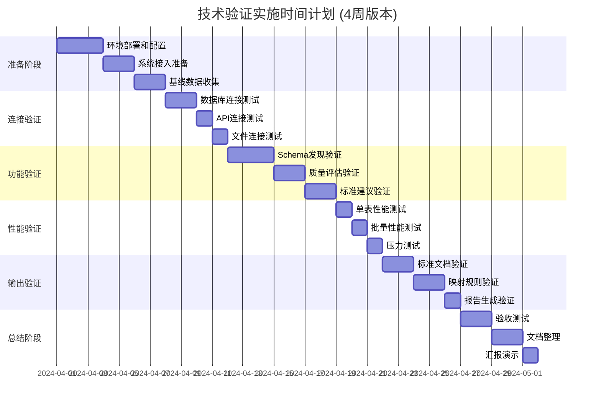

# 异构系统数据自动发现 - 技术验证与试点实施计划

## 一、验证目标与范围

### 1.1 验证目标
1. **技术可行性验证**：验证RANGEN数据发现模块能否自动分析异构系统数据结构
2. **实施效率评估**：评估自动化数据标准制定和映射生成的效率提升
3. **数据质量基线**：建立现有系统的数据质量基线，识别主要问题
4. **业务价值验证**：验证自动化分析对数据中台实施的实际业务价值

### 1.2 验证范围
| 验证维度 | 具体内容 | 成功标准 |
|----------|----------|----------|
| **连接性验证** | 测试不同数据源类型连接 | 成功连接率 > 95% |
| **Schema发现** | 表结构、字段信息、约束提取 | 发现准确率 > 90% |
| **数据质量评估** | 完整性、准确性、一致性分析 | 评估覆盖度 > 80% |
| **标准建议** | 智能命名规范、数据类型推荐 | 采纳率 > 70% |
| **映射生成** | 源到目标映射规则生成 | 自动生成率 > 60% |

## 二、验证系统选择标准

### 2.1 系统选择矩阵
```yaml
系统选择标准:
  业务重要性: 40%权重
    1. 核心业务系统（ERP、CRM、电商平台）
    2. 高使用频率系统
    3. 跨部门依赖系统
  
  技术可行性: 30%权重
    1. 有API或数据库访问权限
    2. 技术文档相对完整
    3. 系统运行稳定
  
  数据代表性: 20%权重
    1. 包含典型数据类型（客户、产品、订单）
    2. 数据结构相对复杂
    3. 存在已知数据质量问题
  
  实施风险: 10%权重
    1. 系统稳定性风险低
    2. 业务影响风险可控
    3. 安全合规风险可管理
```

### 2.2 建议试点系统（2-3个）
基于上述标准，建议选择以下系统组合：

#### 组合A：业务价值最高
1. **CRM系统**（如Salesforce、HubSpot、国内CRM）
   - 业务价值：高（客户数据是核心资产）
   - 技术可行性：中（通常有API接口）
   - 代表性：高（包含客户、联系人、交互数据）

2. **电商平台**（如淘宝、京东、自建电商）
   - 业务价值：高（直接产生收入）
   - 技术可行性：中-高（API和数据库访问）
   - 代表性：高（订单、产品、用户数据）

#### 组合B：技术挑战适中
1. **ERP系统**（如SAP、Oracle、金蝶、用友）
   - 业务价值：极高（企业核心数据）
   - 技术可行性：中-低（可能复杂）
   - 代表性：极高（全业务数据）

2. **OA/协同办公系统**
   - 业务价值：中
   - 技术可行性：高（API相对规范）
   - 代表性：中（组织、流程数据）

## 三、技术验证实施步骤

### 3.1 第一阶段：准备阶段 (3-5天)
```bash
# 步骤1：环境准备
1. 部署RANGEN数据发现模块
2. 配置开发/测试环境
3. 准备测试数据和连接配置

# 步骤2：系统接入准备
1. 获取试点系统访问权限
2. 准备API密钥、数据库连接信息
3. 设置安全隔离环境

# 步骤3：基线数据收集
1. 手动收集试点系统基本信息
2. 记录已知的数据问题
3. 建立性能基准
```

### 3.2 第二阶段：连接验证 (2-3天)
```yaml
连接验证测试用例:
  数据库连接:
    - MySQL/Oracle/PostgreSQL连接测试
    - 连接超时和重试机制验证
    - 大表查询性能测试
  
  API连接:
    - REST API认证和授权测试
    - API速率限制处理测试
    - 错误处理和重试机制
  
  文件连接:
    - CSV/JSON/XML文件格式识别
    - 大文件分块处理测试
    - 编码和分隔符自动检测
```

### 3.3 第三阶段：功能验证 (5-7天)
```python
# 功能验证清单
validation_checklist = {
    "schema_discovery": [
        "表结构自动发现",
        "字段类型自动推断", 
        "主键和外键识别",
        "约束和索引识别",
        "数据分布分析"
    ],
    "quality_assessment": [
        "完整性检查（空值率）",
        "准确性检查（数据验证）",
        "一致性检查（跨表一致性）",
        "及时性检查（数据新鲜度）",
        "异常值检测"
    ],
    "standard_recommendation": [
        "智能命名规范建议",
        "数据类型标准化建议",
        "业务含义自动推断",
        "行业模板匹配"
    ]
}
```

### 3.4 第四阶段：性能验证 (2-3天)
```yaml
性能验证指标:
  处理性能:
    单个表分析时间: < 30秒
    100个表批量分析时间: < 10分钟
    数据采样性能: 支持百万级数据采样
    
  资源使用:
    CPU使用率: < 70% (峰值)
    内存使用: < 4GB (基准)
    磁盘IO: 可接受范围内
    
  可扩展性:
    并发连接数: 支持10+并发
    大数据量处理: 支持TB级数据源
    分布式处理: 支持水平扩展
```

### 3.5 第五阶段：输出验证 (3-4天)
```bash
# 验证生成的输出物
1. 数据标准文档验证（完整性、准确性）
2. ETL映射规则验证（可执行性、正确性）
3. 数据质量报告验证（问题识别准确率）
4. 实施建议验证（可行性、优先级）
```

## 四、所需资源与依赖

### 4.1 技术资源
```yaml
硬件资源:
  测试服务器: 8核CPU, 16GB内存, 200GB磁盘
  网络带宽: 100Mbps+ 网络连接
  存储空间: 500GB+ 测试数据存储
  
软件环境:
  操作系统: Linux (Ubuntu 20.04+ / CentOS 7+)
  数据库: PostgreSQL 12+ (用于元数据存储)
  Python环境: Python 3.9+, 相关依赖包
  容器环境: Docker, Docker Compose (可选)
  
第三方服务:
  监控工具: Prometheus + Grafana
  日志系统: ELK Stack (可选)
  版本控制: Git
```

### 4.2 人力资源
```yaml
核心团队:
  数据架构师: 1人 (技术决策、架构设计)
  数据工程师: 2人 (实施开发、测试)
  业务分析师: 1人 (需求分析、业务验证)
  系统管理员: 1人 (环境部署、运维)
  
支持团队:
  试点系统负责人: 各1人 (访问权限、业务知识)
  安全团队: 1人 (安全合规审查)
  项目管理: 1人 (进度跟踪、沟通协调)
```

### 4.3 数据资源
```yaml
测试数据:
  生产数据脱敏样本: 建议使用真实数据脱敏
  测试数据生成: 使用工具生成模拟数据
  性能测试数据: 大规模测试数据集
  
连接信息:
  数据库连接字符串: 主机、端口、数据库名、认证信息
  API端点信息: URL、认证方式、速率限制
  文件访问路径: 文件位置、访问权限、格式信息
```

## 五、风险管理与应对

### 5.1 技术风险
| 风险项 | 概率 | 影响 | 应对措施 |
|--------|------|------|----------|
| 连接失败 | 中 | 高 | 1. 多连接器备选方案 2. 详细错误日志 3. 人工介入流程 |
| 性能不达标 | 中 | 中 | 1. 性能优化方案 2. 分布式处理支持 3. 异步处理机制 |
| 数据安全 | 高 | 高 | 1. 数据脱敏策略 2. 访问控制严格化 3. 审计日志完整 |

### 5.2 业务风险
| 风险项 | 概率 | 影响 | 应对措施 |
|--------|------|------|----------|
| 业务中断 | 低 | 高 | 1. 只读访问 2. 非生产环境 3. 业务低峰期操作 |
| 数据泄露 | 中 | 高 | 1. 数据脱敏 2. 访问审计 3. 最小权限原则 |
| 项目延期 | 高 | 中 | 1. 敏捷迭代 2. MVP优先 3. 定期检视 |

### 5.3 组织风险
| 风险项 | 概率 | 影响 | 应对措施 |
|--------|------|------|----------|
| 团队技能不足 | 中 | 中 | 1. 培训计划 2. 知识传递 3. 外部专家支持 |
| 部门协作不畅 | 高 | 中 | 1. 高层支持 2. 定期沟通 3. 利益相关者管理 |
| 资源冲突 | 中 | 中 | 1. 资源优先级 2. 灵活调整 3. 备选方案 |

## 六、成功度量与验收标准

### 6.1 技术成功指标
```python
technical_metrics = {
    "connection_success_rate": 0.95,  # 连接成功率
    "schema_discovery_accuracy": 0.90,  # Schema发现准确率
    "quality_assessment_coverage": 0.80,  # 质量评估覆盖度
    "standard_recommendation_adoption": 0.70,  # 标准建议采纳率
    "mapping_generation_accuracy": 0.60,  # 映射生成准确率
    "performance_targets": {
        "single_table_analysis": 30,  # 单表分析时间(秒)
        "batch_analysis": 600,  # 批量分析时间(秒)
        "memory_usage": 4096,  # 内存使用(MB)
    }
}
```

### 6.2 业务成功指标
```python
business_metrics = {
    "time_savings": {
        "schema_analysis": 0.70,  # Schema分析时间减少70%
        "standard_definition": 0.60,  # 标准定义时间减少60%
        "mapping_development": 0.50,  # 映射开发时间减少50%
    },
    "quality_improvement": {
        "data_completeness": 0.20,  # 数据完整性提升20%
        "data_consistency": 0.25,  # 数据一致性提升25%
        "issue_identification": 0.80,  # 问题识别率80%
    },
    "stakeholder_satisfaction": {
        "technical_team": 4.0,  # 技术团队满意度(1-5)
        "business_users": 4.0,  # 业务用户满意度(1-5)
        "management": 4.0,  # 管理层满意度(1-5)
    }
}
```

### 6.3 验收标准
```yaml
验收条件:
  必须满足:
    - 所有核心功能通过测试
    - 技术指标达到目标值的80%
    - 无严重安全漏洞
    - 文档完整且可用
  
  期望满足:
    - 技术指标达到目标值的100%
    - 业务指标达到目标值的80%
    - 用户满意度 > 4.0/5.0
    - 所有风险得到有效控制
  
  超出期望:
    - 业务指标达到目标值的100%
    - 发现并解决未知问题
    - 建立可复用的最佳实践
    - 获得业务部门主动推广
```

## 七、实施时间计划

### 7.1 详细时间安排 (4周版本)


### 7.2 里程碑节点
| 里程碑 | 时间点 | 交付物 | 验收标准 |
|--------|--------|--------|----------|
| M1: 环境就绪 | 第1周末 | 部署文档、测试环境 | 环境可用，基础测试通过 |
| M2: 连接验证完成 | 第2周中 | 连接验证报告 | 所有连接器测试通过 |
| M3: 功能验证完成 | 第3周末 | 功能验证报告 | 核心功能全部通过 |
| M4: 性能验证完成 | 第4周初 | 性能测试报告 | 性能指标达标 |
| M5: 验证完成 | 第4周末 | 完整验证报告 | 所有验收标准满足 |

## 八、下一步行动建议

### 8.1 立即行动项
```bash
# 1. 确认试点系统选择
#   请提供以下信息：
#   - 建议的2-3个试点系统名称
#   - 系统类型（数据库/API/文件）
#   - 大致数据量级
#   - 访问权限状态

# 2. 准备技术环境
#   - 确认服务器资源可用性
#   - 准备网络访问配置
#   - 安装基础软件环境

# 3. 组建项目团队
#   - 确认核心团队成员
#   - 安排启动会议
#   - 制定详细周计划
```

### 8.2 技术验证启动清单
```yaml
启动前准备:
  - [ ] 试点系统访问权限确认
  - [ ] 测试环境服务器准备
  - [ ] 网络防火墙配置完成
  - [ ] 数据脱敏方案确认
  - [ ] 团队培训材料准备
  - [ ] 监控和日志系统部署
  - [ ] 备份和恢复方案确认
  - [ ] 安全合规审查通过
```

### 8.3 沟通与协作机制
```yaml
沟通计划:
  每日站会: 15分钟，团队进度同步
  每周评审: 1小时，进展回顾和计划调整
  双周演示: 2小时，向利益相关者展示成果
  月度汇报: 向管理层汇报整体进展
  
协作工具:
  项目管理: Jira/Trello/Asana
  文档协作: Confluence/Notion
  代码管理: Git/GitLab/GitHub
  即时通讯: Slack/钉钉/企业微信
```

## 九、附录

### 9.1 试点系统信息收集模板
```yaml
试点系统信息表:
  基本信息:
    系统名称: 
    系统类型: [数据库/API服务/文件系统/SaaS平台]
    厂商/开发方: 
    部署年份: 
    当前状态: [生产/测试/开发]
  
  技术信息:
    访问方式: [JDBC/REST API/SOAP/FTP/SFTP]
    技术栈: [数据库类型/开发语言/框架]
    数据量级: [记录数/存储大小]
    连接参数: [示例]
  
  业务信息:
    主要业务功能: 
    关键数据实体: [客户/产品/订单等]
    使用部门: 
    业务重要性: [高/中/低]
  
  已知问题:
    数据质量问题: 
    集成困难: 
    性能问题: 
```

### 9.2 技术验证报告模板
```markdown
# 技术验证报告

## 执行摘要
[验证目标、范围、主要发现]

## 验证结果
### 连接性验证
[成功连接的系统、连接问题、解决方案]

### 功能验证  
[各功能模块验证结果、发现的问题、改进建议]

### 性能验证
[性能测试数据、瓶颈分析、优化建议]

### 输出验证
[生成的标准文档质量、映射规则准确性]

## 建议与结论
### 技术可行性结论
[是否具备大规模推广的技术条件]

### 实施建议
[下一步实施的具体建议、优先级]

### 风险提示
[发现的主要风险、缓解措施]

## 附录
[详细测试数据、日志、配置文件]
```

---

**文档版本**: 1.0.0  
**创建日期**: 2026-03-09  
**更新计划**: 根据试点系统确认后更新详细计划  
**联系信息**: RANGEN技术验证团队