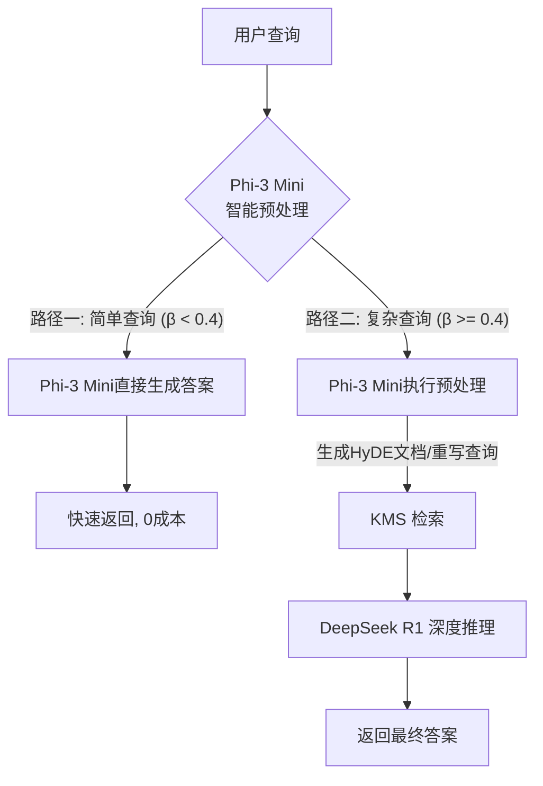

# P3: Phi-3 Mini 集成计划 (The "Front-End Brain" Strategy)

本计划旨在通过引入 **Phi-3 Mini** 作为本地“副驾驶”，构建分层智能架构，以显著降低云端大模型（DeepSeek R1）的调用成本并提升系统响应速度。

## 1. 架构愿景：分层智能 (Tiered Intelligence)

当前架构是“重脑”模式（所有请求均由 DeepSeek R1 处理）。P3 阶段将转型为“轻重结合”模式：

*   **Front-End Brain (Phi-3 Mini)**: 本地运行，负责守门、分流、预处理和简单应答。
*   **Back-End Brain (DeepSeek R1)**: 云端运行，专注于复杂推理和最终决策。

## 2. 实施路线图

### Phase 3.1: 本地推理基础设施 (Day 1-2)
*   **目标**: 在本地环境成功运行 Phi-3 Mini，并封装为标准服务。
*   **任务**:
    1.  集成 `llama.cpp` 或 `mlx-lm` (针对 Mac 优化) 作为推理后端。
    2.  下载并部署 `Phi-3-mini-4k-instruct` (量化版，如 Q4_K_M)。
    3.  实现 `LocalLLMService` 类，提供 `generate()` 和 `analyze_complexity()` 接口。

### Phase 3.2: 智能路由与守门员逻辑 (Day 3-4)
*   **目标**: 让 Phi-3 能够准确判断查询难度（Beta 值），拦截简单问题。
*   **任务**:
    1.  **Prompt Engineering**: 设计专门用于 Phi-3 的分类 Prompt，要求输出 JSON 格式的复杂度评分。
    2.  **路由集成**: 修改 `RealReasoningEngine`，在流程最前端插入 `LocalLLMService.analyze()`。
    3.  **直通逻辑**: 实现简单问题的直接回答路径，跳过后续所有复杂流程。

### Phase 3.3: 智能预处理 (Day 5-6)
*   **目标**: 利用 Phi-3 提升复杂查询的检索质量，减轻 R1 的预处理负担。
*   **任务**:
    1.  **HyDE 生成**: 让 Phi-3 为复杂查询生成假设性文档。
    2.  **Query Rewrite**: 让 Phi-3 将口语化查询重写为适合检索的关键词组合。
    3.  **上下文压缩**: (可选) 尝试让 Phi-3 对检索到的长文档进行摘要，减少传给 R1 的 Token 数。

## 3. 预期收益

| 维度 | 现状 (Pure DeepSeek) | 目标 (Hybrid Phi-3) | 预期提升 |
| :--- | :--- | :--- | :--- |
| **平均响应时间** | ~3-5s | < 1s (简单查询) | **500%** (针对简单场景) |
| **API 成本** | $$$ | $ | **降低 40-60%** |
| **隐私性** | 低 (全量上传) | 中 (简单问题不出本地) | **显著提升** |
| **系统健壮性** | 强依赖网络 | 具备离线基本能力 | **高** |

## 4. 风险与缓解

1.  **误判风险**: Phi-3 将复杂问题误判为简单问题。
    *   *对策*: 设置保守的阈值 (Beta < 0.4)，并引入置信度检查。
2.  **幻觉风险**: Phi-3 在预处理时引入错误信息。
    *   *对策*: 仅让 Phi-3 做格式化和扩充工作，核心事实依赖检索结果。
3.  **资源占用**: 本地模型占用内存和 CPU/GPU。
    *   *对策*: 使用 4-bit 量化版本 (约 2.5GB 显存)，对现代开发机压力极小。

## 5. 下一步行动 (Next Actions)

1.  [ ] 确认本地环境是否支持运行 Phi-3 (推荐使用 `ollama` 或 `llama-cpp-python`)。
2.  [ ] 创建 `src/services/local_llm_service.py` 原型。
3.  [ ] 编写测试脚本验证 Phi-3 的指令遵循能力。
