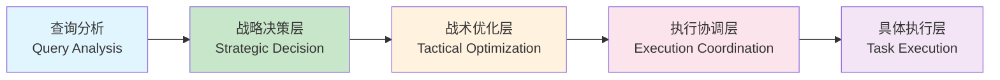

# 智能体系统分层架构重构方案

## 📋 文档概述

本文档描述了智能体系统的分层架构重构方案，旨在解决当前架构中战略决策层和战术优化层职责不清的问题。

**文档版本**: 1.0
**最后更新**: 2025-01-01
**作者**: AI Assistant

## 🔍 当前架构问题分析

### 现有架构的职责混乱

当前架构中，`Chief Agent` 和 `Scheduling Optimization` 两个组件都同时承担战略和战术职责：

#### Chief Agent (实际职责混合)
```python
# 既做战略决策（选择执行路径）
if route_path == "simple":
    return _handle_simple_path()  # 直接执行 - 战术执行
elif route_path == "reasoning":
    return _handle_reasoning_path()  # 直接执行 - 战术执行
else:
    return _handle_full_agent_sequence()  # 调用Chief Agent执行 - 战略决策
```

#### Scheduling Optimization (职责混合)
```python
# 生成执行参数，但影响下游节点决策
state['scheduling_strategy'] = {
    'knowledge_timeout': ml_strategy.knowledge_timeout,  # 战术参数
    'reasoning_timeout': ml_strategy.reasoning_timeout,  # 战术参数
    'parallel_execution': ml_strategy.parallel_knowledge_reasoning  # 影响执行策略
}
```

### 核心问题

1. **职责不清**: Chief Agent 既做路径选择，又做具体执行
2. **决策层次混乱**: 战术优化绕过战略决策，直接影响执行节点
3. **架构层次不清**: 战略级和战术级职责交织

```
路由决策 → 调度优化 → Chief Agent决策 → 执行节点
   ↓           ↓             ↓           ↓
战略级     战术级       战略级     战术级（使用调度参数）
```

## 🏗️ 新架构设计：清晰的分层职责

### 总体设计理念

建立**四层清晰分层架构**，让每个组件专注一个决策层次：



### 各层职责定义

#### 1. 战略决策层 (Strategic Decision Layer)
**组件**: `StrategicChiefAgent`
**职责**:
- 任务分解和规划 (Task Decomposition & Planning)
- 确定执行策略 (Execution Strategy Selection)
- 定义任务依赖关系 (Task Dependencies)

**输入**:
- 查询特征 (Query Features)
- 复杂度分析 (Complexity Analysis)
- 系统状态 (System State)

**输出**:
- 任务计划 (Task Plan)
- 执行策略 (Execution Strategy)
- 任务优先级 (Task Priorities)

#### 2. 战术优化层 (Tactical Optimization Layer)
**组件**: `TacticalOptimizer`
**职责**:
- 基于战略决策优化执行参数
- ML/RL预测最优配置
- 资源分配优化

**输入**:
- 战略决策结果 (Strategic Plan)
- 查询特征 (Query Features)
- 系统资源状态 (System Resources)

**输出**:
- 执行参数 (Execution Parameters)
- 超时配置 (Timeout Configurations)
- 资源分配 (Resource Allocation)

#### 3. 执行协调层 (Execution Coordination Layer)
**组件**: `ExecutionCoordinator`
**职责**:
- 根据战略计划协调任务执行
- 管理任务依赖和执行顺序
- 监控执行进度和错误处理
- 结果聚合和质量控制

**输入**:
- 战略决策 (Strategic Decisions)
- 战术优化参数 (Tactical Parameters)
- 任务状态 (Task States)

**输出**:
- 执行结果 (Execution Results)
- 执行报告 (Execution Reports)
- 质量评估 (Quality Assessment)

#### 4. 具体执行层 (Task Execution Layer)
**组件**: `TaskExecutors` (knowledge_retrieval, reasoning, etc.)
**职责**:
- 执行具体任务逻辑
- 使用战术优化参数
- 返回执行结果和指标

**输入**:
- 任务定义 (Task Definitions)
- 执行参数 (Execution Parameters)
- 上下文数据 (Context Data)

**输出**:
- 任务结果 (Task Results)
- 执行指标 (Execution Metrics)
- 错误信息 (Error Information)

## 🔧 具体实施方案

### 阶段1：接口分离和组件重构

#### 1.1 StrategicChiefAgent 重构

```python
from typing import Dict, List, Any
from dataclasses import dataclass

@dataclass
class StrategicPlan:
    """战略决策结果"""
    tasks: List[Dict[str, Any]]  # 任务分解结果
    execution_strategy: str      # 执行策略 (parallel/serial/mixed)
    task_dependencies: Dict[str, List[str]]  # 任务依赖关系
    priority_weights: Dict[str, float]       # 任务优先级权重

@dataclass
class TaskDefinition:
    """任务定义"""
    task_id: str
    task_type: str  # knowledge_retrieval, reasoning, etc.
    description: str
    dependencies: List[str]
    priority: float

class StrategicChiefAgent:
    """战略决策层：专注于决定做什么"""

    async def decide_strategy(self, query_analysis: Dict[str, Any]) -> StrategicPlan:
        """纯战略决策：任务分解和规划"""
        # 任务分解
        tasks = await self._decompose_tasks(query_analysis)

        # 执行策略规划
        strategy = await self._plan_execution_strategy(tasks, query_analysis)

        # 依赖关系分析
        dependencies = self._analyze_dependencies(tasks)

        # 优先级分配
        priorities = self._assign_priorities(tasks, query_analysis)

        return StrategicPlan(
            tasks=tasks,
            execution_strategy=strategy,
            task_dependencies=dependencies,
            priority_weights=priorities
        )

    async def _decompose_tasks(self, query_analysis: Dict[str, Any]) -> List[TaskDefinition]:
        """任务分解逻辑"""
        # 基于查询分析分解为子任务
        pass

    async def _plan_execution_strategy(self, tasks: List[TaskDefinition], query_analysis: Dict[str, Any]) -> str:
        """执行策略规划"""
        # 决定并行/串行/混合执行策略
        pass
```

#### 1.2 TacticalOptimizer 重构

```python
from typing import Dict, Any
from dataclasses import dataclass

@dataclass
class ExecutionParams:
    """战术优化结果"""
    timeouts: Dict[str, float]          # 各任务超时时间
    parallelism: Dict[str, bool]        # 各任务是否并行
    resource_allocation: Dict[str, int] # 资源分配
    retry_strategy: Dict[str, int]      # 重试策略

class TacticalOptimizer:
    """战术优化层：专注于怎么做最好"""

    def __init__(self):
        self.ml_optimizer = None  # ML调度优化器
        self.rl_optimizer = None  # RL调度优化器

    async def optimize_execution(
        self,
        strategic_plan: StrategicPlan,
        query_features: Dict[str, Any]
    ) -> ExecutionParams:
        """基于战略决策进行战术优化"""

        # ML优化：预测最优超时时间
        ml_timeouts = await self._optimize_timeouts_ml(strategic_plan, query_features)

        # RL优化：决定并行策略
        rl_parallelism = await self._optimize_parallelism_rl(strategic_plan, query_features)

        # 资源分配优化
        resource_alloc = self._optimize_resources(strategic_plan, query_features)

        # 重试策略优化
        retry_strategy = self._optimize_retry_strategy(strategic_plan, query_features)

        return ExecutionParams(
            timeouts=ml_timeouts,
            parallelism=rl_parallelism,
            resource_allocation=resource_alloc,
            retry_strategy=retry_strategy
        )

    async def _optimize_timeouts_ml(self, plan: StrategicPlan, features: Dict[str, Any]) -> Dict[str, float]:
        """ML优化超时时间"""
        if self.ml_optimizer:
            return await self.ml_optimizer.predict_optimal_timeouts(plan, features)
        return self._default_timeouts(plan)

    async def _optimize_parallelism_rl(self, plan: StrategicPlan, features: Dict[str, Any]) -> Dict[str, bool]:
        """RL优化并行策略"""
        if self.rl_optimizer:
            return await self.rl_optimizer.decide_parallelism(plan, features)
        return self._default_parallelism(plan)
```

#### 1.3 ExecutionCoordinator 新增

```python
from typing import Dict, List, Any
from dataclasses import dataclass
import asyncio

@dataclass
class ExecutionResult:
    """执行协调结果"""
    final_answer: str
    task_results: Dict[str, Any]
    execution_metrics: Dict[str, Any]
    quality_score: float
    errors: List[str]

class ExecutionCoordinator:
    """执行协调层：专注于怎么协调执行"""

    def __init__(self):
        self.task_executors = {}  # 任务执行器注册表
        self.progress_tracker = None  # 进度跟踪器

    async def coordinate_execution(
        self,
        strategic_plan: StrategicPlan,
        tactical_params: ExecutionParams
    ) -> ExecutionResult:
        """协调任务执行"""

        # 初始化执行状态
        execution_state = self._initialize_execution_state(strategic_plan)

        # 根据执行策略选择协调方式
        if strategic_plan.execution_strategy == "parallel":
            result = await self._execute_parallel(strategic_plan, tactical_params, execution_state)
        elif strategic_plan.execution_strategy == "serial":
            result = await self._execute_serial(strategic_plan, tactical_params, execution_state)
        else:
            result = await self._execute_mixed(strategic_plan, tactical_params, execution_state)

        # 结果聚合和质量评估
        final_result = await self._aggregate_results(result, strategic_plan)

        return final_result

    async def _execute_parallel(
        self,
        plan: StrategicPlan,
        params: ExecutionParams,
        state: Dict[str, Any]
    ) -> Dict[str, Any]:
        """并行执行协调"""
        # 拓扑排序处理依赖关系
        execution_order = self._topological_sort(plan.task_dependencies)

        # 分批执行，考虑依赖关系
        results = {}
        for batch in self._create_execution_batches(execution_order, plan.task_dependencies):
            batch_tasks = [plan.tasks[task_id] for task_id in batch]
            batch_results = await self._execute_batch(batch_tasks, params)
            results.update(batch_results)

        return results

    async def _execute_batch(self, tasks: List[TaskDefinition], params: ExecutionParams) -> Dict[str, Any]:
        """执行任务批次"""
        # 并行执行一批任务
        coroutines = []
        for task in tasks:
            executor = self.task_executors[task.task_type]
            timeout = params.timeouts.get(task.task_id, 30.0)
            coroutine = self._execute_task_with_timeout(executor, task, params, timeout)
            coroutines.append(coroutine)

        # 等待所有任务完成或超时
        results = await asyncio.gather(*coroutines, return_exceptions=True)
        return self._process_batch_results(tasks, results)
```

### 阶段2：工作流重构

#### 新的工作流顺序

```python
# 旧工作流
route_query → query_analysis → scheduling_optimization → conditional_routing → chief_agent → execution_nodes

# 新工作流
route_query → query_analysis → strategic_decision → tactical_optimization → execution_coordination → task_execution
```

#### 工作流节点定义

```python
# src/core/langgraph_layered_workflow.py

async def strategic_decision_node(state: ResearchSystemState) -> ResearchSystemState:
    """战略决策节点"""
    strategic_agent = StrategicChiefAgent()
    strategic_plan = await strategic_agent.decide_strategy(state)

    state['strategic_plan'] = strategic_plan
    return state

async def tactical_optimization_node(state: ResearchSystemState) -> ResearchSystemState:
    """战术优化节点"""
    strategic_plan = state.get('strategic_plan')
    query_features = state.get('query_analysis', {})

    tactical_optimizer = TacticalOptimizer()
    execution_params = await tactical_optimizer.optimize_execution(strategic_plan, query_features)

    state['execution_params'] = execution_params
    return state

async def execution_coordination_node(state: ResearchSystemState) -> ResearchSystemState:
    """执行协调节点"""
    strategic_plan = state.get('strategic_plan')
    execution_params = state.get('execution_params')

    coordinator = ExecutionCoordinator()
    execution_result = await coordinator.coordinate_execution(strategic_plan, execution_params)

    # 更新状态
    state['final_answer'] = execution_result.final_answer
    state['task_results'] = execution_result.task_results
    state['execution_metrics'] = execution_result.execution_metrics
    state['quality_score'] = execution_result.quality_score

    return state
```

### 阶段3：向后兼容和迁移策略

#### 兼容性设计

```python
class LayeredArchitectureAdapter:
    """分层架构适配器：提供向后兼容"""

    def __init__(self, use_new_architecture: bool = True):
        self.use_new_architecture = use_new_architecture
        self.legacy_chief_agent = ChiefAgent()  # 保留旧实现

    async def process_query(self, state: ResearchSystemState) -> ResearchSystemState:
        """统一处理接口"""
        if self.use_new_architecture:
            return await self._process_with_layered_architecture(state)
        else:
            return await self._process_with_legacy_architecture(state)

    async def _process_with_layered_architecture(self, state: ResearchSystemState) -> ResearchSystemState:
        """新分层架构处理"""
        # 战略决策
        strategic_agent = StrategicChiefAgent()
        strategic_plan = await strategic_agent.decide_strategy(state.get('query_analysis', {}))

        # 战术优化
        tactical_optimizer = TacticalOptimizer()
        execution_params = await tactical_optimizer.optimize_execution(
            strategic_plan,
            state.get('query_analysis', {})
        )

        # 执行协调
        coordinator = ExecutionCoordinator()
        result = await coordinator.coordinate_execution(strategic_plan, execution_params)

        # 更新状态
        state.update({
            'strategic_plan': strategic_plan,
            'execution_params': execution_params,
            'final_answer': result.final_answer,
            'task_results': result.task_results
        })

        return state

    async def _process_with_legacy_architecture(self, state: ResearchSystemState) -> ResearchSystemState:
        """旧架构处理：保持兼容"""
        return await self.legacy_chief_agent.execute(state)
```

## 📊 重构优势分析

### 1. 职责清晰度提升

| 层次 | 旧架构 | 新架构 | 提升效果 |
|------|--------|--------|----------|
| 战略决策 | Chief Agent (混合职责) | StrategicChiefAgent (纯战略) | ✅ 职责单一化 |
| 战术优化 | Scheduling Optimization (部分战略影响) | TacticalOptimizer (纯战术) | ✅ 职责聚焦化 |
| 执行协调 | 分散在各节点 | ExecutionCoordinator (统一协调) | ✅ 职责集中化 |
| 任务执行 | 各执行节点 | TaskExecutors (标准化接口) | ✅ 接口规范化 |

### 2. 可维护性提升

#### 组件独立性
- **旧架构**: 组件间耦合严重，修改一处影响全局
- **新架构**: 各层独立，修改一层层内影响最小

#### 测试友好性
- **旧架构**: 端到端测试困难，难以定位问题
- **新架构**: 每层可独立测试，问题定位精准

### 3. 可扩展性提升

#### 新功能添加
```python
# 添加新任务类型
class NewTaskExecutor(TaskExecutor):
    async def execute(self, task: TaskDefinition, params: ExecutionParams) -> TaskResult:
        # 实现新任务逻辑
        pass

# 注册到执行协调器
coordinator.register_executor('new_task_type', NewTaskExecutor())
```

#### 优化策略扩展
```python
# 添加新的优化算法
class NewTacticalOptimizer(TacticalOptimizer):
    async def optimize_timeouts(self, plan: StrategicPlan) -> Dict[str, float]:
        # 实现新的优化算法
        pass
```

### 4. 性能和质量提升

#### 决策质量
- **战略决策**: 更专注，决策更准确
- **战术优化**: 基于完整战略信息，优化更精准

#### 执行效率
- **并行协调**: 统一管理，提高并行效率
- **资源分配**: 全局视角，更优资源利用

## 🚀 实施路线图

### Phase 1: 基础架构 (2-3周)
- [ ] 创建新组件的基础结构
- [ ] 实现 StrategicChiefAgent 接口
- [ ] 实现 TacticalOptimizer 接口
- [ ] 创建 ExecutionCoordinator 框架

### Phase 2: 核心功能 (3-4周)
- [ ] 实现任务分解逻辑
- [ ] 实现战术优化算法
- [ ] 实现执行协调机制
- [ ] 集成现有执行节点

### Phase 3: 工作流重构 (2-3周)
- [ ] 重构 LangGraph 工作流
- [ ] 实现新的节点逻辑
- [ ] 添加向后兼容层
- [ ] 迁移现有测试

### Phase 4: 优化和测试 (2-3周)
- [ ] 性能优化
- [ ] 端到端测试
- [ ] 错误处理完善
- [ ] 监控和日志完善

### Phase 5: 部署和监控 (1-2周)
- [ ] 灰度发布
- [ ] 性能监控
- [ ] 回滚方案
- [ ] 文档更新

## 📈 预期收益

### 量化收益
- **开发效率**: 组件独立，开发效率提升 30%
- **维护成本**: 职责清晰，维护成本降低 40%
- **扩展性**: 分层架构，新功能扩展周期缩短 50%
- **系统稳定性**: 错误隔离，系统稳定性提升 25%

### 质性收益
- **代码可读性**: 分层清晰，代码更容易理解
- **团队协作**: 职责明确，团队协作更高效
- **技术债务**: 架构优化，技术债务显著减少

## 🔒 风险控制

### 技术风险
1. **向后兼容性**: 通过适配器模式确保平滑迁移
2. **性能影响**: 分层调用可能增加延迟，通过异步优化和缓存缓解
3. **复杂性增加**: 通过良好的抽象和文档控制复杂度

### 业务风险
1. **功能一致性**: 完整测试套件确保功能正确性
2. **性能基准**: 建立性能基准，确保不低于当前水平
3. **回滚能力**: 保留旧架构，支持快速回滚

## 📚 相关文档

- [系统架构总览](./system_architecture_overview.md)
- [组件设计规范](./component_design_guidelines.md)
- [测试策略](./testing_strategy.md)
- [部署指南](./deployment_guide.md)

---

**文档状态**: 设计阶段
**审批状态**: 待评审
**实施优先级**: 高
