# 🏗️ 系统架构图

RANGEN系统的整体架构图和分层设计说明，展示系统各组件之间的关系和数据流。

## 🎯 概述

RANGEN采用分层微服务架构，通过清晰的职责分离和模块化设计，支持大规模AI智能体协作和复杂任务处理。系统整体架构分为六层，从用户接口到底层基础设施。

## 📊 整体架构图

### 核心架构图

以下是RANGEN系统的完整架构图，展示各层组件和连接关系：

```mermaid
graph TB
    %% 用户层
    subgraph "👤 用户层 (User Layer)"
        U1[Web客户端]
        U2[移动客户端]
        U3[API客户端]
        U4[第三方集成]
    end

    %% 接入层
    subgraph "🔐 接入层 (Access Layer)"
        GW[API网关]
        LB[负载均衡器]
        AUTH[身份认证]
        RATE[限流熔断]
    end

    %% 智能体层
    subgraph "🤖 智能体层 (Agent Layer)"
        subgraph "战略层"
            CA[首席智能体]
            SA[战略智能体]
            AA[审核智能体]
        end
        
        subgraph "战术层"
            EA[专家智能体]
            MC[多智能体协调器]
            RE[推理专家]
        end
        
        subgraph "执行层"
            RA[ReAct智能体]
            RAG[RAG智能体]
            VA[验证智能体]
            CIA[引用智能体]
        end
    end

    %% 服务层
    subgraph "⚙️ 服务层 (Service Layer)"
        subgraph "核心服务"
            RS[路由服务]
            KS[知识服务]
            TS[训练服务]
            MS[监控服务]
        end
        
        subgraph "支撑服务"
            CS[配置服务]
            LS[学习服务]
            AS[告警服务]
            ES[事件服务]
        end
    end

    %% 数据层
    subgraph "💾 数据层 (Data Layer)"
        subgraph "存储层"
            PSQL[(PostgreSQL)]
            REDIS[(Redis)]
            ES[(Elasticsearch)]
            MINIO[(MinIO/S3)]
        end
        
        subgraph "向量存储"
            VS[向量数据库<br/>Pinecone/Qdrant]
            KG[知识图谱]
            CH[向量缓存]
        end
    end

    %% 基础设施层
    subgraph "🛠️ 基础设施层 (Infrastructure Layer)"
        subgraph "容器编排"
            K8S[Kubernetes]
            DC[Docker]
            HELM[Helm]
        end
        
        subgraph "监控观测"
            OTEL[OpenTelemetry]
            PROM[Prometheus]
            GRAF[Grafana]
            LOKI[Loki]
        end
    end

    %% 连接关系
    U1 --> GW
    U2 --> GW
    U3 --> GW
    U4 --> GW

    GW --> LB
    LB --> AUTH
    AUTH --> RATE
    RATE --> CA

    CA --> SA
    CA --> AA
    CA --> EA
    
    EA --> MC
    MC --> RE
    RE --> RA
    
    RA --> RAG
    RAG --> VA
    VA --> CIA
    
    CIA --> RS
    RS --> KS
    KS --> TS
    TS --> MS
    
    MS --> CS
    CS --> LS
    LS --> AS
    AS --> ES
    
    ES --> PSQL
    PSQL --> REDIS
    REDIS --> ES
    ES --> MINIO
    
    MINIO --> VS
    VS --> KG
    KG --> CH
    
    CH --> K8S
    K8S --> DC
    DC --> HELM
    
    HELM --> OTEL
    OTEL --> PROM
    PROM --> GRAF
    GRAF --> LOKI

    %% 样式定义
    classDef userLayer fill:#e1f5fe,stroke:#01579b,stroke-width:2px
    classDef accessLayer fill:#f3e5f5,stroke:#4a148c,stroke-width:2px
    classDef agentLayer fill:#e8f5e8,stroke:#1b5e20,stroke-width:2px
    classDef serviceLayer fill:#fff3e0,stroke:#e65100,stroke-width:2px
    classDef dataLayer fill:#fce4ec,stroke:#880e4f,stroke-width:2px
    classDef infraLayer fill:#f5f5f5,stroke:#424242,stroke-width:2px

    class U1,U2,U3,U4 userLayer
    class GW,LB,AUTH,RATE accessLayer
    class CA,SA,AA,EA,MC,RE,RA,RAG,VA,CIA agentLayer
    class RS,KS,TS,MS,CS,LS,AS,ES serviceLayer
    class PSQL,REDIS,ES,MINIO,VS,KG,CH dataLayer
    class K8S,DC,HELM,OTEL,PROM,GRAF,LOKI infraLayer
```



### 架构演化

RANGEN系统架构经历了三个主要版本的演化：

```
V1.0 (基础架构) → V2.0 (智能体架构) → V3.0 (反思型架构)
    │                    │                    │
单一服务        多智能体协作       自我优化系统
```

## 🏛️ 架构分层详解

### 1. 用户层 (User Layer)

**组件**：
- **Web客户端**：基于浏览器的交互界面
- **移动客户端**：iOS/Android移动应用
- **API客户端**：第三方系统通过RESTful API接入
- **第三方集成**：企业级集成接口

**技术栈**：
- 前端：Vue.js 3 + TypeScript
- 移动端：React Native
- API：OpenAPI 3.0规范

### 2. 接入层 (Access Layer)

**组件**：
- **API网关**：统一入口，请求路由
- **负载均衡器**：流量分发，高可用保障
- **身份认证**：JWT/OAuth2认证授权
- **限流熔断**：保护后端服务

**特性**：
- 支持横向扩展
- 微服务网关模式
- 统一认证授权

### 3. 智能体层 (Agent Layer)

RANGEN系统的核心，包含19个智能体组件：

#### 战略层 (3个)
- **首席智能体**：系统总协调者
- **战略智能体**：长期策略规划
- **审核智能体**：质量控制和审计

#### 战术层 (5个)
- **专家智能体**：领域专业知识
- **多智能体协调器**：协作协调
- **推理专家**：复杂逻辑分析
- **战术优化器**：执行策略优化
- **学习优化器**：学习过程优化

#### 执行层 (11个)
- **ReAct智能体**：推理-执行循环
- **RAG智能体**：检索增强生成
- **验证智能体**：结果验证
- **引用智能体**：引用生成
- **推理智能体**：基础推理
- **检索智能体**：知识检索
- **质量控制器**：质量控制
- **安全守卫**：安全检查
- **上下文工程智能体**：上下文管理
- **提示词工程智能体**：提示优化
- **记忆管理器**：状态管理

### 4. 服务层 (Service Layer)

#### 核心服务
- **路由服务**：智能请求路由
- **知识服务**：知识检索和管理
- **训练服务**：模型训练和优化
- **监控服务**：系统监控和指标收集

#### 支撑服务
- **配置服务**：动态配置管理
- **学习服务**：持续学习协调
- **告警服务**：异常检测和告警
- **事件服务**：事件驱动架构

### 5. 数据层 (Data Layer)

#### 结构化存储
- **PostgreSQL**：关系型数据，用户信息，配置数据
- **Redis**：缓存，会话管理，实时数据
- **Elasticsearch**：全文搜索，日志分析

#### 非结构化存储
- **MinIO/S3**：文件存储，模型文件，文档
- **向量数据库**：向量相似度搜索，知识嵌入
- **知识图谱**：关系数据，语义网络

### 6. 基础设施层 (Infrastructure Layer)

#### 容器编排
- **Kubernetes**：容器编排和调度
- **Docker**：容器化部署
- **Helm**：应用包管理

#### 监控观测
- **OpenTelemetry**：分布式追踪
- **Prometheus**：指标收集
- **Grafana**：数据可视化
- **Loki**：日志聚合

## 🔄 数据流和工作流

### 标准请求处理流程

```
用户请求 → API网关 → 认证授权 → 智能路由 → 
智能体协作 → 服务调用 → 数据访问 → 
结果生成 → 验证审核 → 返回用户
```

### 智能体协作流程

```
1. 请求接收 → 首席智能体
2. 任务分解 → 专家智能体分配
3. 并行执行 → 多个执行智能体
4. 结果整合 → 审核智能体验证
5. 质量检查 → 质量控制器评估
6. 最终返回 → 用户接收结果
```

### 学习优化流程

```
执行过程 → 数据收集 → 反思分析 → 
模式识别 → 策略优化 → 规则更新 → 
下一轮执行（优化后）
```

## 🧩 关键架构模式

### 1. 分层架构 (Layered Architecture)
- 清晰的职责分离
- 层间松耦合
- 独立可扩展性

### 2. 微服务架构 (Microservices)
- 独立部署和扩展
- 技术栈灵活性
- 故障隔离

### 3. 事件驱动架构 (Event-Driven)
- 异步处理
- 解耦组件
- 实时响应

### 4. 智能体导向架构 (Agent-Oriented)
- 自主决策
- 协作执行
- 自我优化

### 5. 反思型架构 (Reflective Architecture)
- 自我诊断
- 持续改进
- 零微调学习

## ⚡ 性能特性

### 扩展性
- **水平扩展**：无状态服务支持自动扩展
- **垂直扩展**：资源密集型服务独立扩展
- **地理分布**：多区域部署支持

### 可靠性
- **高可用**：99.95% SLA保障
- **容错性**：智能故障转移
- **数据一致性**：最终一致性模型

### 性能指标
- **延迟**：P95 < 500ms
- **吞吐量**：支持1000+ QPS
- **并发**：支持10000+并发连接

## 🔧 部署架构

### 开发环境
```
单节点部署 → 所有组件运行在同一台机器
便于开发和测试
```

### 测试环境
```
多容器部署 → Docker Compose编排
模拟生产环境配置
```

### 生产环境
```
Kubernetes集群 → 多节点高可用部署
自动扩缩容和故障恢复
```

### 云原生架构
```
公有云/私有云部署
混合云和多云支持
服务网格集成
```

## 📈 架构演进路线

### V3.0 (当前版本)
- 反思型架构
- 多模型路由
- 训练框架集成

### V3.1 (规划中)
- 增强反思机制
- 优化路由算法
- 完善训练框架

### V3.2 (规划中)
- 多模态支持
- 分布式反思
- 联邦学习集成

### V4.0 (愿景)
- 完全自主进化
- 通用反思框架
- 开源组件库

## 📋 架构决策记录

### 关键决策
1. **采用微服务架构**：实现技术栈灵活性和独立扩展性
2. **智能体导向设计**：支持复杂协作和自主决策
3. **反思型架构集成**：实现系统自我优化
4. **云原生技术栈**：确保可扩展性和可靠性

### 技术选型理由
- **Python**：AI/ML生态丰富，开发效率高
- **FastAPI**：高性能异步API框架
- **LangGraph**：工作流编排和智能体协调
- **Kubernetes**：业界标准容器编排平台
- **PostgreSQL**：功能丰富的关系型数据库

## 🔗 相关文档

### 详细架构文档
- [完整架构图](../system-overview/rangen_system_complete_architecture_diagram.md)
- [组件设计](../component-design/)
- [设计模式](../patterns/)

### 技术参考
- [API文档](../../reference/api/)
- [配置指南](../../getting-started/installation/configuration.md)
- [部署指南](../../operations/deployment/)

### 开发文档
- [智能体开发](../../development/agents/)
- [服务开发](../../development/services/)
- [测试指南](../../development/testing/)

## 📝 更新日志

| 版本 | 日期 | 更新内容 |
|------|------|----------|
| 1.0.0 | 2026-03-07 | 初始版本，创建系统架构图文档 |
| 1.0.1 | 2026-03-07 | 添加智能体层详细说明 |
| 1.0.2 | 2026-03-07 | 完善架构演进和部署架构 |

---

*最后更新：2026-03-07*  
*文档版本：1.0.2*  
*维护团队：RANGEN架构设计组*
