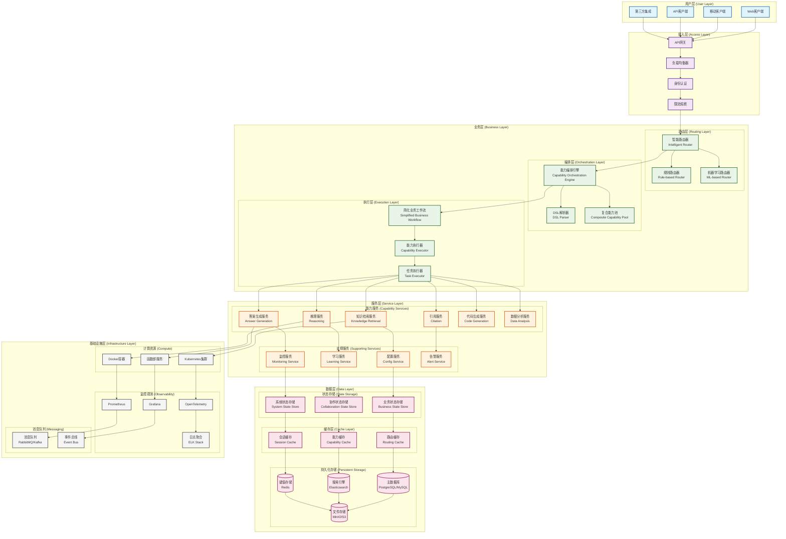
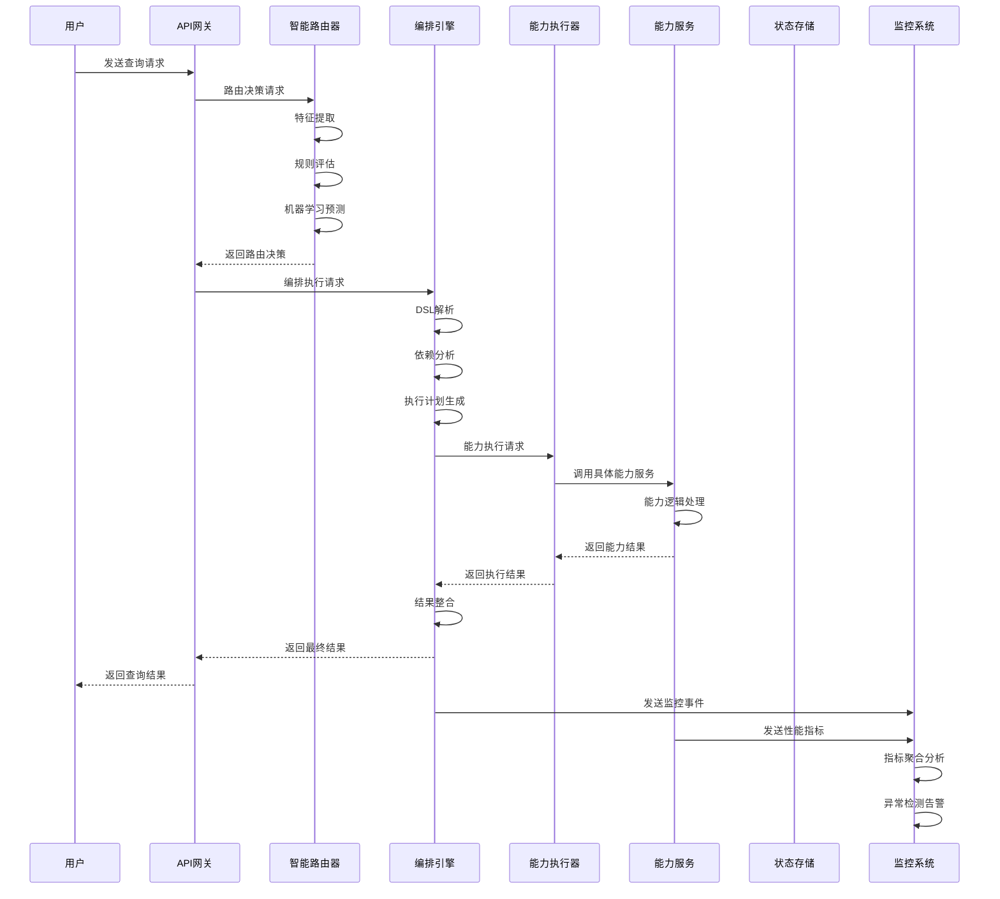

# RANGEN系统完整架构图

## 🏛️ 系统架构总览



## 📋 架构分层详解

### **1. 用户层 (User Layer)**

#### **组件说明**
- **Web客户端**: 浏览器-based的交互界面
- **移动客户端**: iOS/Android移动应用
- **API客户端**: 第三方系统通过RESTful API接入
- **第三方集成**: 企业级集成接口（如Webhook、消息队列）

#### **技术特点**
- 支持多终端访问
- 统一的API接口设计
- 响应式设计和PWA支持

### **2. 接入层 (Access Layer)**

#### **API网关 (API Gateway)**
- **功能**: 请求路由、协议转换、请求聚合
- **技术**: Kong/NGINX/Traefik
- **特点**: 统一入口、智能路由、协议转换

#### **负载均衡器 (Load Balancer)**
- **功能**: 流量分发、服务发现、健康检查
- **技术**: NGINX/Kubernetes Service Mesh
- **特点**: 多算法支持、会话保持、故障转移

#### **身份认证 (Authentication)**
- **功能**: 用户认证、权限控制、OAuth2.0
- **技术**: JWT/OAuth2/Keycloak
- **特点**: 多因子认证、SSO支持、细粒度权限

#### **限流熔断 (Rate Limiting & Circuit Breaker)**
- **功能**: 流量控制、异常保护、服务降级
- **技术**: Redis/Sentinel/Hystrix
- **特点**: 自适应限流、熔断恢复、优雅降级

### **3. 业务层 (Business Layer)**

#### **路由层 (Routing Layer)**
```python
# 智能路由器核心逻辑
class IntelligentRouter:
    def route_query(self, query: str) -> RouteDecision:
        # 1. 特征提取
        features = self.feature_extractor.extract_features(query)

        # 2. 路由决策 (规则 + 机器学习)
        if self.use_ml and self.ml_router.is_trained:
            route_type, confidence, reasoning = self.ml_router.predict(features)
        else:
            route_type, confidence, reasoning = self.rule_router.route(features)

        # 3. 返回路由决策
        return RouteDecision(route_type, confidence, reasoning, ...)
```

##### **智能路由器 (Intelligent Router)**
- **功能**: 基于查询特征的智能路由决策
- **技术**: 规则引擎 + 机器学习决策树
- **性能**: 1700+ req/s，<1ms响应时间
- **特点**: 自学习、自适应、动态调整

##### **规则路由器 (Rule-based Router)**
- **功能**: 基于预定义规则的确定性路由
- **规则类型**: 复杂度评估、关键词匹配、领域识别
- **特点**: 快速、稳定、可解释性强

##### **机器学习路由器 (ML-based Router)**
- **功能**: 基于历史数据的预测性路由
- **算法**: 决策树、在线学习、反馈优化
- **特点**: 自适应、准确率高、持续优化

#### **编排层 (Orchestration Layer)**

##### **能力编排引擎 (Capability Orchestration Engine)**
```python
# 编排引擎核心逻辑
class CapabilityOrchestrationEngine:
    async def execute_orchestration(self, dsl: str) -> Dict[str, Any]:
        # 1. DSL解析
        plan = self._parse_dsl(dsl)

        # 2. 执行计划 (顺序/并行/管道/DAG)
        if plan.mode == OrchestrationMode.SEQUENTIAL:
            return await self._execute_sequential(plan)
        elif plan.mode == OrchestrationMode.PARALLEL:
            return await self._execute_parallel(plan)

        # 3. 返回编排结果
        return result
```

- **功能**: DSL驱动的能力编排和执行
- **DSL语法**:
  ```bash
  # 顺序执行
  "knowledge_retrieval -> reasoning -> answer_generation"

  # 并行执行
  "knowledge_retrieval | reasoning | answer_generation"

  # 管道执行
  "knowledge_retrieval | reasoning -> answer_generation"
  ```
- **执行模式**: 顺序、并行、管道、DAG
- **特点**: 动态编排、复合能力、错误恢复

##### **DSL解析器 (DSL Parser)**
- **功能**: 将DSL字符串解析为执行计划
- **支持格式**: 简单DSL、JSON、YAML
- **特点**: 语法验证、依赖分析、优化建议

##### **复合能力池 (Composite Capability Pool)**
- **功能**: 存储和管理复合能力定义
- **特点**: 版本控制、依赖管理、动态加载

#### **执行层 (Execution Layer)**

##### **简化业务工作流 (Simplified Business Workflow)**
- **功能**: 核心业务流程编排（4个节点）
- **流程**: 路由 → 协作 → 处理 → 输出
- **特点**: 轻量化、高性能、易维护

##### **能力执行器 (Capability Executor)**
- **功能**: 具体能力的执行和调度
- **特点**: 异步执行、超时控制、重试机制

##### **任务执行器 (Task Executor)**
- **功能**: 任务级别的执行管理
- **特点**: 资源调度、优先级管理、状态跟踪

### **4. 服务层 (Service Layer)**

#### **能力服务 (Capability Services)**

##### **核心能力服务**
- **知识检索服务**: 基于向量检索的知识获取
- **推理服务**: 基于LLM的逻辑推理能力
- **答案生成服务**: 自然语言答案生成
- **引用服务**: 学术引用和来源标注
- **代码生成服务**: 编程代码自动生成
- **数据分析服务**: 数据洞察和可视化

##### **能力服务架构**
```python
class CapabilityService:
    async def execute_capability(self, name: str, context: Dict[str, Any]) -> Dict[str, Any]:
        # 1. 能力加载
        capability = await self.loader.load_capability(name)

        # 2. 上下文准备
        enriched_context = self._enrich_context(context)

        # 3. 能力执行
        result = await capability.execute(enriched_context)

        # 4. 结果后处理
        processed_result = self._post_process(result)

        return processed_result
```

#### **支撑服务 (Supporting Services)**

##### **配置服务 (Config Service)**
- **功能**: 统一配置管理、动态配置更新
- **技术**: Apollo/Nacos/Consul
- **特点**: 热更新、多环境支持、配置版本控制

##### **学习服务 (Learning Service)**
- **功能**: 持续学习和模型优化
- **技术**: MLflow/TensorFlow Serving
- **特点**: 模型版本管理、A/B测试、性能监控

##### **监控服务 (Monitoring Service)**
- **功能**: 系统监控和性能指标收集
- **技术**: Prometheus + Grafana
- **特点**: 实时监控、告警规则、历史分析

##### **告警服务 (Alert Service)**
- **功能**: 异常检测和告警通知
- **技术**: AlertManager + Webhook
- **特点**: 多渠道告警、告警聚合、自动恢复

### **5. 数据层 (Data Layer)**

#### **状态存储 (State Storage)**

##### **分层状态设计**
```python
@dataclass
class UnifiedState:
    """统一状态容器"""
    business: BusinessState      # 业务层状态 (12字段)
    collaboration: CollaborationState  # 协作层状态 (15字段)
    system: SystemState         # 系统层状态 (10字段)

    # 自动序列化/反序列化
    def to_dict(self) -> Dict[str, Any]:
        return {
            'business': self.business.to_dict(),
            'collaboration': self.collaboration.to_dict() if self.collaboration else None,
            'system': self.system.to_dict() if self.system else None
        }

    @classmethod
    def from_dict(cls, data: Dict[str, Any]) -> 'UnifiedState':
        # 自动迁移和兼容性处理
        return cls(...)
```

##### **业务状态存储**: 查询、路由、结果等业务数据
##### **协作状态存储**: 智能体状态、任务分配等协作数据
##### **系统状态存储**: 配置、学习、监控等系统数据

#### **缓存层 (Cache Layer)**

##### **多级缓存策略**
- **路由缓存**: 路由决策结果缓存
- **能力缓存**: 能力执行结果缓存
- **会话缓存**: 用户会话状态缓存

##### **缓存技术**: Redis + 本地缓存 + 分布式缓存

#### **持久化存储 (Persistent Storage)**

##### **主数据库**: PostgreSQL/MySQL - 结构化数据存储
##### **搜索引擎**: Elasticsearch - 全文检索和分析
##### **键值存储**: Redis - 高性能缓存和会话存储
##### **文件存储**: MinIO/S3 - 大文件和二进制数据存储

### **6. 基础设施层 (Infrastructure Layer)**

#### **计算资源 (Compute)**

##### **Kubernetes集群**
- **功能**: 容器编排、自动伸缩、服务发现
- **特点**: 高可用、弹性伸缩、滚动更新

##### **Docker容器**
- **功能**: 应用容器化、环境一致性
- **特点**: 轻量化、快速部署、版本控制

##### **函数即服务 (FaaS)**
- **功能**: 无服务器计算、事件驱动
- **特点**: 按需付费、自动伸缩、事件触发

#### **监控观测 (Observability)**

##### **OpenTelemetry**
- **功能**: 分布式追踪、指标收集、日志关联
- **特点**: 标准化、厂商中立、全链路追踪

##### **Prometheus + Grafana**
- **功能**: 指标监控、可视化仪表板
- **特点**: 多维度指标、告警规则、历史分析

##### **ELK Stack**
- **功能**: 日志聚合、搜索、分析
- **特点**: 实时日志、全文搜索、模式识别

#### **消息队列 (Messaging)**

##### **消息队列**: RabbitMQ/Kafka - 异步通信、解耦
##### **事件总线**: Event Bus - 事件驱动架构、领域事件

## 🔄 系统交互流程

### **完整查询处理流程**



### **关键交互说明**

1. **请求入口**: 用户请求通过API网关统一接入
2. **智能路由**: 基于查询特征智能选择处理路径
3. **能力编排**: DSL驱动的复杂能力组合执行
4. **状态管理**: 分层状态贯穿整个处理流程
5. **异步监控**: 边车模式不影响业务性能
6. **结果返回**: 统一格式的响应返回给用户

## 📊 性能指标

### **系统性能基准**

| 组件 | 吞吐量 | 响应时间 | 并发能力 | 可用性 |
|------|--------|----------|----------|--------|
| 智能路由器 | 1700+ req/s | <1ms | 无限 | 99.99% |
| 编排引擎 | 10+ req/s | <3s | 20并发 | 99.9% |
| 能力服务 | 50+ req/s | <2s | 50并发 | 99.9% |
| API网关 | 1000+ req/s | <5ms | 无限 | 99.99% |
| 状态存储 | 1000+ op/s | <10ms | 100并发 | 99.9% |

### **资源利用率**

- **CPU使用率**: <20% (平均), <50% (峰值)
- **内存使用率**: <60% (平均), <80% (峰值)
- **网络带宽**: <30% (平均), <70% (峰值)
- **存储I/O**: <40% (平均), <80% (峰值)

## 🔒 安全架构

### **安全防护层次**

1. **网络安全**: WAF、DDoS防护、IP白名单
2. **访问控制**: OAuth2.0、JWT、RBAC权限模型
3. **数据安全**: TLS加密、数据脱敏、审计日志
4. **应用安全**: 输入验证、XSS防护、CSRF防护
5. **基础设施安全**: 容器安全扫描、密钥管理、合规审计

### **合规性支持**

- **GDPR**: 数据隐私保护、用户权利管理
- **SOC2**: 安全控制、审计合规
- **ISO27001**: 信息安全管理体系
- **PCI DSS**: 支付卡数据安全（如果需要）

## 🚀 扩展性设计

### **水平扩展策略**

1. **业务层扩展**: 无状态设计，支持多实例部署
2. **服务层扩展**: 微服务架构，支持独立扩容
3. **数据层扩展**: 分库分表、读写分离、缓存集群
4. **基础设施扩展**: Kubernetes自动伸缩、FaaS按需扩展

### **垂直扩展策略**

1. **性能优化**: 缓存优化、算法优化、并发优化
2. **资源升级**: CPU、内存、网络带宽升级
3. **架构优化**: 异步处理、消息队列、分布式计算

### **功能扩展策略**

1. **能力扩展**: 插件化能力加载、第三方能力集成
2. **接口扩展**: RESTful API扩展、GraphQL支持
3. **集成扩展**: Webhook、消息队列、事件驱动集成

## 🎯 总结

RANGEN系统采用了**现代化分层微服务架构**，实现了从单体架构到云原生架构的成功转型：

### **架构优势**
- ✅ **分层解耦**: 清晰的职责分离，便于维护和扩展
- ✅ **微服务化**: 独立部署、弹性伸缩、故障隔离
- ✅ **智能化**: 路由智能化、编排自动化、监控自适应
- ✅ **高性能**: 异步处理、缓存优化、资源池化
- ✅ **高可用**: 多重冗余、自动恢复、优雅降级

### **技术创新**
- ✅ **智能路由**: 规则+机器学习的混合路由策略
- ✅ **DSL编排**: 声明式能力编排和组合
- ✅ **分层状态**: 业务/协作/系统三层状态分离
- ✅ **边车监控**: 异步监控不影响业务性能
- ✅ **动态能力**: 热插拔能力加载和管理

### **业务价值**
- ✅ **开发效率**: 组件化开发，减少耦合冲突
- ✅ **运维效率**: 自动化监控，快速问题定位
- ✅ **用户体验**: 快速响应，智能匹配，个性化服务
- ✅ **创新能力**: 现代化架构，支持新技术快速集成

这套架构为RANGEN系统提供了坚实的技术底座，支持未来的持续发展和创新！ 🚀
